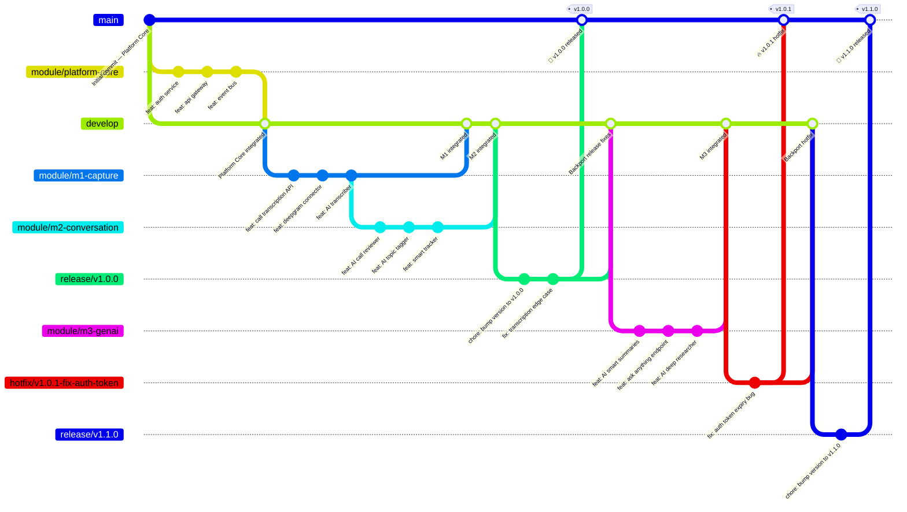
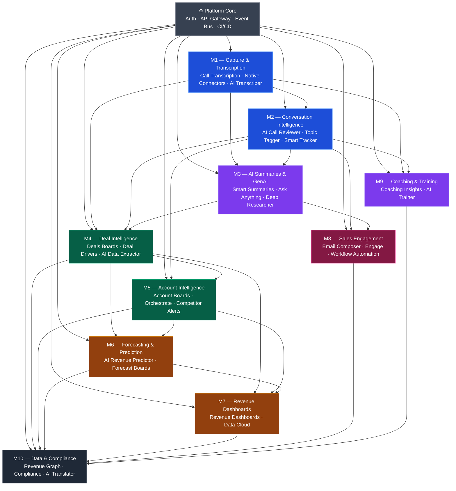

# Git Branching Strategy
### R-Revenue Intelligence Platform
**Version:** 1.0
**Last Updated:** April 2026
**Status:** 🟢 Active

---

# 1. Overview & Purpose

This document defines the official Git branching strategy for the **R-Revenue Intelligence Platform** — a modular, AI-powered revenue intelligence system built to capture, analyze, and act on customer interaction data across the full sales lifecycle. It serves as the single source of truth for how code is branched, merged, released, and maintained across all teams and modules.

---

## 1.1 Document Scope

This document covers the complete Git workflow for the R-Revenue Intelligence Platform, including:

- **Branch architecture** — the types of branches used, their purpose, and their lifecycle
- **Naming conventions** — standardized naming rules for all branch types
- **Merge and PR rules** — how code moves from development to production
- **Module-specific branching** — individual branch strategies for all 10 product modules (M1–M10) and Platform Core
- **Release management** — versioning, tagging, and release branch workflows
- **CI/CD integration** — how branches map to environments and pipeline triggers
- **Team access control** — branch ownership, permissions, and code review responsibilities

This document applies to:
- All source code repositories under the R-Revenue Intelligence Platform
- All engineering teams contributing to the platform (frontend, backend, AI/ML, DevOps)
- All environments: local development → dev → staging → production
- Ticket tracking is managed in **Linear** using the `RRI-XXX` identifier format (for example, `RRI-305`)

> **Out of Scope:** This document does not cover sprint planning, ticket workflows, or deployment infrastructure details. Those are covered in separate documents.

---

## 1.2 Product Context (R-Revenue Intelligence Platform)

The R-Revenue Intelligence Platform is an AI-powered B2B SaaS product that records, transcribes, analyzes, and acts on sales calls and customer interactions. It is structured as a **modular monolith** built in **TypeScript (NestJS)** and **Python (FastAPI)**, deployed progressively from **Railway → AWS**.

The platform is organized into **10 independently deliverable product modules** plus a **Platform Core** that serves as the non-sellable technical foundation:

| Module | Name | Core Value |
|:---:|:---|:---|
| Platform Core | Infrastructure Foundation | Auth, API Gateway, Event Bus, CI/CD |
| M1 | Capture & Transcription | Record and read every call |
| M2 | Conversation Intelligence | Understand what's happening in calls |
| M3 | AI Summaries & GenAI | Get instant answers from your calls |
| M4 | Deal Intelligence | See health of every deal |
| M5 | Account Intelligence | Manage your accounts strategically |
| M6 | Forecasting & Prediction | Predict revenue accurately |
| M7 | Revenue Dashboards | Visualize performance |
| M8 | Sales Engagement | Execute outreach consistently |
| M9 | Coaching & Training | Develop every rep |
| M10 | Data & Compliance | Govern data and stay compliant |

Each module has its own set of features, services, and development teams. The branching strategy is designed to allow **parallel development across all modules** without blocking each other, while maintaining a **stable, always-deployable `main` branch**.

---

## 1.3 Repository Strategy

### Decision: Monorepo ✅

After evaluating both approaches, the R-Revenue Intelligence Platform adopts a **Monorepo strategy** — all 10 modules and Platform Core live within a **single Git repository**, organized into clearly separated directories.

### Why Monorepo over Multi-repo?

| Factor | Monorepo ✅ | Multi-repo ❌ |
|--------|------------|--------------|
| **Cross-module changes** | Single PR spans multiple modules | Requires coordinated PRs across repos |
| **Shared Platform Core** | One source of truth for Auth, Event Bus, API Gateway | Duplicated or versioned as a package |
| **CI/CD simplicity** | One unified pipeline with module-scoped triggers | Separate pipelines per repo to maintain |
| **Dependency management** | Internal imports, no package versioning overhead | Must publish and version internal packages |
| **Onboarding** | Single repo to clone, one set of contribution rules | Multiple repos, multiple access setups |
| **Atomic releases** | Tag one commit to release the full platform | Must coordinate tags across 10+ repos |
| **Code visibility** | All teams see all modules — promotes alignment | Siloed visibility per team |

### Repository Root Structure
```text
r-revenue-intelligence/
├── apps/
│ ├── web/ # Next.js frontend
│ ├── api/ # NestJS core backend
│ └── ai-services/ # FastAPI AI/ML services
├── modules/
│ ├── platform-core/ # Auth, API Gateway, Event Bus, CI/CD
│ ├── m1-capture/ # Capture & Transcription
│ ├── m2-conversation/ # Conversation Intelligence
│ ├── m3-genai/ # AI Summaries & GenAI
│ ├── m4-deals/ # Deal Intelligence
│ ├── m5-accounts/ # Account Intelligence
│ ├── m6-forecasting/ # Forecasting & Prediction
│ ├── m7-dashboards/ # Revenue Dashboards
│ ├── m8-engagement/ # Sales Engagement
│ ├── m9-coaching/ # Coaching & Training
│ └── m10-compliance/ # Data & Compliance
├── shared/ # Shared utilities, types, constants
├── infra/ # Infrastructure as Code (Terraform, Docker)
├── docs/ # All documentation including this file
│ └── git-branching-strategy.md
├── .github/
│ ├── workflows/ # GitHub Actions CI/CD pipelines
│ └── CODEOWNERS # Branch ownership per module
├── package.json
└── README.md
```


---

## 1.4 Audience

This document is intended for the following roles within the R-Revenue Intelligence Platform engineering organization:

| Role | How This Document Applies |
|------|--------------------------|
| **Engineering Leads / Tech Leads** | Define and enforce branching rules per module team |
| **Frontend Engineers** | Follow feature branch and PR conventions for `apps/web` |
| **Backend Engineers** | Manage module-level branches for `apps/api` and `modules/mX-*` |
| **AI/ML Engineers** | Branch and contribute to `apps/ai-services` and AI-heavy modules (M2, M3, M6, M9) |
| **DevOps / Platform Engineers** | Manage protected branches, CI/CD triggers, and environment promotions |
| **QA Engineers** | Understand branch-to-environment mapping for test planning |
| **Product Managers** | Understand release branch timelines and module delivery sequencing |
| **New Team Members** | Use this as the onboarding reference for all Git workflows |

> 💡 **All contributors to this repository are expected to have read and understood this document before raising their first Pull Request.**

---


# 2. Repository Structure

This section defines the physical layout of the monorepo and how each of the 10 product modules maps to directories within it. A consistent, predictable folder structure ensures that every engineer — regardless of their module team — can navigate the codebase confidently.

---

## 2.1 Monorepo Folder Layout

The repository is organized into **six top-level directories**, each with a distinct responsibility. No module team should place code outside their designated directory without a cross-team review.


```text
r-revenue-intelligence/ # 🏠 Root of the monorepo
│
├── apps/ # 🖥️ Deployable applications
│ ├── web/ # Next.js 14 — Frontend SPA
│ │ ├── src/
│ │ │ ├── app/ # App router pages
│ │ │ ├── components/ # Shared UI components
│ │ │ ├── modules/ # Per-module UI pages & components
│ │ │ │ ├── m1-capture/
│ │ │ │ ├── m2-conversation/
│ │ │ │ ├── m3-genai/
│ │ │ │ ├── m4-deals/
│ │ │ │ ├── m5-accounts/
│ │ │ │ ├── m6-forecasting/
│ │ │ │ ├── m7-dashboards/
│ │ │ │ ├── m8-engagement/
│ │ │ │ ├── m9-coaching/
│ │ │ │ └── m10-compliance/
│ │ │ ├── hooks/ # Global React hooks
│ │ │ ├── store/ # Global state (Zustand / Redux)
│ │ │ └── styles/ # Global CSS / Tailwind config
│ │ ├── public/
│ │ ├── next.config.ts
│ │ └── package.json
│ │
│ ├── api/ # NestJS — Core Backend (Modular Monolith)
│ │ ├── src/
│ │ │ ├── main.ts # App entry point
│ │ │ ├── app.module.ts # Root module
│ │ │ ├── modules/ # NestJS module imports (M1–M10)
│ │ │ ├── common/ # Guards, interceptors, filters, pipes
│ │ │ ├── config/ # Environment config & validation
│ │ │ └── events/ # Event Bus publishers & listeners
│ │ ├── test/
│ │ ├── nest-cli.json
│ │ └── package.json
│ │
│ └── ai-services/ # FastAPI — Python AI/ML Services
│ ├── src/
│ │ ├── main.py # FastAPI entry point
│ │ ├── routers/ # Per-module AI endpoints
│ │ │ ├── transcription.py # M1
│ │ │ ├── conversation.py # M2
│ │ │ ├── summaries.py # M3
│ │ │ ├── deals.py # M4
│ │ │ ├── forecasting.py # M6
│ │ │ └── coaching.py # M9
│ │ ├── agents/ # LangGraph AI agents
│ │ ├── pipelines/ # Transcription & processing pipelines
│ │ └── models/ # Pydantic schemas
│ ├── tests/
│ ├── requirements.txt
│ └── Dockerfile
│
├── modules/ # 🧩 Product Module Implementations
│ ├── platform-core/ # ⚙️ Foundation (not sold)
│ ├── m1-capture/ # M1 — Capture & Transcription
│ ├── m2-conversation/ # M2 — Conversation Intelligence
│ ├── m3-genai/ # M3 — AI Summaries & GenAI
│ ├── m4-deals/ # M4 — Deal Intelligence
│ ├── m5-accounts/ # M5 — Account Intelligence
│ ├── m6-forecasting/ # M6 — Forecasting & Prediction
│ ├── m7-dashboards/ # M7 — Revenue Dashboards
│ ├── m8-engagement/ # M8 — Sales Engagement
│ ├── m9-coaching/ # M9 — Coaching & Training
│ └── m10-compliance/ # M10 — Data & Compliance
│
├── shared/ # 🔗 Shared Code (used across modules)
│ ├── types/ # Global TypeScript interfaces & enums
│ ├── utils/ # Reusable utility functions
│ ├── constants/ # Platform-wide constants
│ ├── decorators/ # Custom NestJS decorators
│ └── dto/ # Shared Data Transfer Objects
│
├── infra/ # 🏗️ Infrastructure as Code
│ ├── terraform/ # AWS provisioning (prod)
│ ├── docker/ # Dockerfiles per service
│ │ ├── web.Dockerfile
│ │ ├── api.Dockerfile
│ │ └── ai-services.Dockerfile
│ ├── railway/ # Railway deployment configs (dev/staging)
│ └── nginx/ # Reverse proxy config
│
├── docs/ # 📚 All Platform Documentation
│ ├── git-branching-strategy.md # ← THIS DOCUMENT
│ ├── system-architecture.md
│ ├── api-reference.md
│ ├── module-specs/ # Per-module feature specifications
│ │ ├── m1-capture.md
│ │ ├── m2-conversation.md
│ │ └── ...
│ └── adr/ # Architecture Decision Records
│
├── .github/ # 🤖 GitHub Configuration
│ ├── workflows/ # GitHub Actions CI/CD pipelines
│ │ ├── ci.yml # PR validation (lint, test, build)
│ │ ├── cd-staging.yml # Deploy to staging on release/*
│ │ ├── cd-production.yml # Deploy to production on main
│ │ └── module-checks.yml # Per-module affected checks
│ ├── CODEOWNERS # Module ownership rules
│ ├── pull_request_template.md # Standardized PR template
│ └── ISSUE_TEMPLATE/ # Bug report & feature request templates
│
├── .husky/ # 🐶 Git Hooks (pre-commit, commit-msg)
├── .eslintrc.js # Linting rules
├── .prettierrc # Code formatting rules
├── turbo.json # Turborepo task pipeline config
├── pnpm-workspace.yaml # pnpm monorepo workspace config
├── package.json # Root package.json
├── tsconfig.base.json # Base TypeScript config
├── .env.example # Environment variable template
└── README.md # Platform overview & quick start
```


---

## 2.2 Module Directory Mapping (M1–M10 + Platform Core)

Each module under `modules/` follows an **identical internal structure** to ensure consistency across teams. Below is the standard layout every module must follow, followed by the mapping of all 11 modules.

### Standard Module Internal Structure


```text
modules/mX-<module-name>/
│
├── src/
│   ├── controllers/    # HTTP route handlers (NestJS controllers)
│   ├── services/       # Business logic layer
│   ├── repositories/    # Database access layer (Prisma / TypeORM)
│   ├── dto/            # Module-specific Data Transfer Objects
│   ├── entities/       # Database entity definitions
│   ├── events/         # Event publishers and listeners (Event Bus)
│   ├── interfaces/     # TypeScript interfaces for this module
│   └── <module>.module.ts # NestJS module definition
│
├── tests/
│   ├── unit/           # Unit tests (Jest)
│   └── integration/    # Integration tests
│
├── migrations/         # Database migrations specific to this module
├── seeds/              # Test/dev seed data
├── README.md           # Module overview, setup, and API reference
└── CHANGELOG.md        # Module-level changelog
```


---

### Module Directory Map

| Module ID | Directory | Features Housed | Tech Dependency |
|:---:|:---|:---|:---|
| ⚙️ Platform Core | `modules/platform-core/` | Auth, API Gateway, Event Bus, CI/CD | NestJS, JWT, Redis, BullMQ |
| M1 | `modules/m1-capture/` | Call Transcription, Native Connectors, AI Transcriber | Deepgram, Whisper, Webhooks |
| M2 | `modules/m2-conversation/` | AI Call Reviewer, AI Topic Tagger, AI Theme Spotter, Smart Tracker | LangGraph, OpenAI, Python |
| M3 | `modules/m3-genai/` | AI Smart Summaries, Ask Anything, AI Deep Researcher | LangChain, GPT-4o, RAG |
| M4 | `modules/m4-deals/` | Deals Boards, View Deal Drivers, AI Data Extractor | NestJS, PostgreSQL, OpenAI |
| M5 | `modules/m5-accounts/` | Account Boards, Orchestrate, Competitor Alerts | NestJS, Redis, CRM integrations |
| M6 | `modules/m6-forecasting/` | AI Revenue Predictor, Forecast Boards | Python, scikit-learn, FastAPI |
| M7 | `modules/m7-dashboards/` | Revenue Dashboards, Data Cloud | Next.js, Recharts, PostgreSQL |
| M8 | `modules/m8-engagement/` | Email Composer, Engage (To-Do), Workflow Automation | NestJS, SendGrid, BullMQ |
| M9 | `modules/m9-coaching/` | Sales Coaching Insights, AI Trainer | LangGraph, OpenAI, NestJS |
| M10 | `modules/m10-compliance/` | Revenue Graph, Configure Compliance, AI Translator | NestJS, Neo4j, i18n, Audit Logs |

---

### Key Rules for Module Directories

- ✅ Each module **owns its own database migrations** — no module should modify another module's migration files
- ✅ Cross-module data sharing happens **only via the Event Bus** — never via direct service imports between modules
- ✅ Anything used by **2 or more modules** must be moved to `shared/` — not duplicated inside individual modules
- ✅ Every module **must have a `README.md`** that documents its setup, environment variables, and available API endpoints
- ✅ Every module package must declare a workspace name in `package.json` using `@r-revenue/<module-slug>` (e.g., `@r-revenue/m1-capture`, `@r-revenue/m3-genai`, `@r-revenue/platform-core`)
- ❌ No module should import directly from another module's `src/` directory — inter-module communication is **event-driven only**
- ❌ Do not place environment-specific config files inside module directories — all config lives in `apps/api/src/config/`

---


# 3. Branch Architecture 🏗️

The R-Revenue Intelligence Platform follows a **structured Git Flow variant**, adapted for a modular monolith with 10 independently developed modules. The branch architecture is designed around three core principles:

- **Stability** — `main` is always production-deployable, no exceptions
- **Parallelism** — all 10 module teams can develop simultaneously without blocking each other
- **Traceability** — every line of code in production can be traced back to a feature, module, and release branch

---

## 3.1 Core Branches 🛠️

Core branches are **permanent** — they are never deleted and are protected by branch rules enforced at the repository level.

### `main`

The `main` branch represents the **production state** of the platform at all times.

- Always reflects what is **live in production**
- **No direct commits** are ever allowed — code reaches `main` only via a merged `release/*` or `hotfix/*` branch
- Every merge into `main` is **tagged** with a semantic version (e.g., `v1.2.0`)
- Triggers the **production deployment pipeline** automatically on merge
- Protected rules:
  - ✅ Require pull request before merging
  - ✅ Require minimum 3 approving reviews (Engineering Lead + DevOps Engineer + QA Lead)
  - ✅ Require all CI status checks to pass
  - ✅ Require linear history
  - ❌ No force pushes
  - ❌ No branch deletion


```text
main ────●────────────────────●────────────────────●────▶
      v1.0.0                v1.1.0                v1.2.0
```


---

### `develop`

The `develop` branch is the **central integration branch** for all active development across all modules.

- Represents the **latest completed development work** — the next release candidate in progress
- All `module/mX-*` branches merge into `develop` once a module's integration is stable
- Should always be in a **buildable and testable state** (CI must pass at all times)
- Triggers automatic deployment to the **dev/QA environment** on every merge
- Protected rules:
  - ✅ Require pull request before merging
  - ✅ Require minimum 2 approving reviews (module Tech Lead + 1 peer engineer)
  - ✅ Require CI checks to pass (lint, unit tests, build)
  - ❌ No force pushes


```text
develop ────●──────●──────●──────●──────●──────●────▶
           M1    M2+M3    M4     M5    M7+M8    M10
```


---

## 3.2 Supporting Branch Types 📁

Supporting branches are **temporary** — they are created for a specific purpose and deleted after merging.

---

### `release/*`

**Purpose:** Stabilize and prepare a version for production deployment.

- Cut from `develop` when a set of modules is ready to ship
- Only **bug fixes, documentation updates, and version bumps** are allowed on a release branch — no new features
- Merges into **both `main` and `develop`** on completion (to backport fixes)
- Deleted after merging
- Naming format: `release/vMAJOR.MINOR.PATCH`
- Examples:
```text
release/v1.0.0
release/v1.1.0
release/v2.0.0-beta
```

- Triggers deployment to the **staging / UAT environment** automatically

---

### `hotfix/*`

**Purpose:** Emergency fix for a critical bug discovered in production.

- Cut **directly from `main`** — never from `develop`
- Contains only the minimal change required to fix the production issue
- Merges into **both `main` and `develop`** on completion
- Version bump follows patch increment (e.g., `v1.1.0` → `v1.1.1`)
- Deleted after merging
- Naming format: `hotfix/vMAJOR.MINOR.PATCH-<short-description>`
- Examples:
```text
hotfix/v1.0.1-fix-auth-token-expiry
hotfix/v1.1.2-fix-transcription-crash
hotfix/v2.0.1-fix-compliance-audit-log
```

- Requires **immediate review** from Tech Lead and DevOps — SLA: reviewed within 2 hours

---

### `module/mX-*`

**Purpose:** Integration branch for a single product module — sits between individual `feature/*` branches and `develop`.

- One persistent-per-sprint integration branch per module
- All `feature/*`, `bugfix/*`, and `chore/*` branches for a module merge here first
- Acts as the **module-level staging area** before integrating into `develop`
- Module Tech Lead is responsible for this branch's stability
- Naming format: `module/mX-<module-slug>`
- Full list:
```text
module/platform-core
module/m1-capture
module/m2-conversation
module/m3-genai
module/m4-deals
module/m5-accounts
module/m6-forecasting
module/m7-dashboards
module/m8-engagement
module/m9-coaching
module/m10-compliance
```


---

### `feature/*`

**Purpose:** Develop a single, specific feature or user story.

- Always cut from the **module's `module/mX-*` branch** — never directly from `develop` or `main`
- One branch per feature / ticket — kept small and focused
- Should be **short-lived** — ideally completed within a single sprint
- Merges back into the parent `module/mX-*` branch via Pull Request
- Naming format: `feature/mX-<ticket-id>-<short-description>`
- Examples:
```text
feature/m1-RRI-101-call-transcription-api
feature/m1-RRI-102-deepgram-connector
feature/m2-RRI-210-ai-topic-tagger
feature/m3-RRI-310-ask-anything-endpoint
feature/m4-RRI-401-deals-board-ui
feature/m8-RRI-801-email-composer-integration
```


---

### `bugfix/*`

**Purpose:** Fix a non-critical bug found during development or QA (not in production).

- Cut from the **relevant `module/mX-*` branch** if the bug is module-specific
- Cut from `develop` if the bug spans multiple modules or was found during integration testing
- Merges back into its source branch via Pull Request
- Naming format: `bugfix/mX-<ticket-id>-<short-description>`
- Examples:
```text
bugfix/m1-RRI-115-fix-transcription-timeout
bugfix/m4-RRI-445-deal-score-null-pointer
bugfix/m10-RRI-1021-compliance-log-missing-fields
```


---

### `chore/*`

**Purpose:** Non-functional changes that don't affect product behaviour — refactoring, dependency updates, config changes, documentation, test additions.

- Cut from the **relevant `module/mX-*` branch** or `develop` depending on scope
- Does not require QA sign-off but must pass all CI checks
- Naming format: `chore/mX-<short-description>` or `chore/<scope>-<short-description>`
- Examples:
```text
chore/m1-update-deepgram-sdk
chore/m3-refactor-summary-service
chore/infra-upgrade-node-20
chore/docs-update-branching-guide
chore/shared-add-missing-type-exports
```


---

## 3.3 Branch Lifecycle Diagram 📊

The following Mermaid diagram illustrates how branches are created, used, and merged across the full development and release lifecycle.



---

### Branch Hierarchy Summary

```text
main ← 🔴 Production (permanent, protected)
│
├── release/vX.Y.Z ← 🟠 Release stabilization (temporary)
│
develop ← 🟡 Integration (permanent, protected)
│
├── module/platform-core ← 🔵 Platform Core integration (per-sprint)
├── module/m1-capture ← 🔵 M1 module integration (per-sprint)
├── module/m2-conversation ← 🔵 M2 module integration (per-sprint)
├── module/m3-genai ← 🔵 M3 module integration (per-sprint)
├── module/m4-deals ← 🔵 M4 module integration (per-sprint)
├── module/m5-accounts ← 🔵 M5 module integration (per-sprint)
├── module/m6-forecasting ← 🔵 M6 module integration (per-sprint)
├── module/m7-dashboards ← 🔵 M7 module integration (per-sprint)
├── module/m8-engagement ← 🔵 M8 module integration (per-sprint)
├── module/m9-coaching ← 🔵 M9 module integration (per-sprint)
└── module/m10-compliance ← 🔵 M10 module integration (per-sprint)
│
├── feature/mX-* ← 🟢 Individual features (short-lived)
├── bugfix/mX-* ← 🟣 Bug fixes found in dev/QA (short-lived)
└── chore/mX-* ← ⚪ Non-functional changes (short-lived)

main
└── hotfix/vX.Y.Z-* ← 🔴 Emergency production fixes (short-lived)
```


---


### Stale Branch Governance

To prevent branch sprawl in a multi-module monorepo, stale branch automation is mandatory for `feature/*`, `bugfix/*`, and `chore/*` branches.

- A stale warning is posted automatically when no commits are pushed for **14 days**
- Branches inactive for **30 days** are automatically deleted unless marked `keep` by the module Tech Lead
- Exemptions must include a brief reason in the associated ticket

---

# 4. Module Branch Strategy 🧩

Each module follows the same branching lifecycle: features are developed on `feature/*` branches, merged into the module's `module/mX-*` integration branch, and from there merged into `develop`. The sections below define the specific branches, features, and rules for each module.

> **Golden Rule:** Platform Core must always be branched and integrated into `develop` **before** any product module (M1–M10) begins development. All modules depend on it.

---

## 4.1 Platform Core (Foundation — Branched First) ⚙️

**Directory:** `modules/platform-core/`
**Owner:** DevOps / Platform Engineering Team
**Purpose:** Non-sellable technical foundation that every module depends on — authentication, API routing, event communication, and deployment pipeline.

### Module Integration Branch

```text
module/platform-core
```


### Feature Branches

| Branch | Feature | Description |
|--------|---------|-------------|
| `feature/core-RRI-001-auth-service` | Auth Service | JWT-based authentication, refresh tokens, session management |
| `feature/core-RRI-002-api-gateway` | API Gateway | Route registration, rate limiting, request validation |
| `feature/core-RRI-003-event-bus` | Event Bus | BullMQ-based async event system, publishers & listeners |
| `feature/core-RRI-004-cicd-pipeline` | CI/CD Pipeline | GitHub Actions workflows for all environments |
| `feature/core-RRI-005-rbac` | Role-Based Access Control | Permission layers: Admin, Manager, Rep |
| `feature/core-RRI-006-tenant-config` | Multi-Tenancy Config | Tenant isolation, org-level settings |
| `feature/core-RRI-007-health-checks` | Health Checks | `/health` endpoints for all services |
| `feature/core-RRI-008-logging` | Centralized Logging | Structured logging with correlation IDs |

### Branch Rules
- `module/platform-core` must be merged into `develop` **before any other module branch is created**
- No product module may bypass Platform Core services — all auth must go through `core-RRI-001`
- Changes to the Event Bus schema require a **cross-team review** from all module Tech Leads

---

## 4.2 M1 — Capture & Transcription 🎙️

**Directory:** `modules/m1-capture/`
**Standalone Value:** "Record and read every call"
**Owner:** Backend + AI/ML Team
**Depends On:** Platform Core (Auth, API Gateway, Event Bus)

### Module Integration Branch

```text
module/m1-capture
```


### Feature Branches

| Branch | Feature | Description |
|--------|---------|-------------|
| `feature/m1-RRI-101-call-ingestion-api` | Call Transcription | REST API to receive call recordings from connectors |
| `feature/m1-RRI-102-deepgram-connector` | Native Connectors | Deepgram real-time transcription integration |
| `feature/m1-RRI-103-zoom-connector` | Native Connectors | Zoom meeting bot — join, record, stream audio |
| `feature/m1-RRI-104-google-meet-connector` | Native Connectors | Google Meet recording and ingestion |
| `feature/m1-RRI-105-ms-teams-connector` | Native Connectors | Microsoft Teams connector |
| `feature/m1-RRI-106-whisper-transcriber` | AI Transcriber | OpenAI Whisper fallback transcription pipeline |
| `feature/m1-RRI-107-speaker-diarization` | AI Transcriber | Speaker identification and labelling |
| `feature/m1-RRI-108-transcript-storage` | Call Transcription | Store and retrieve transcript segments in PostgreSQL |
| `feature/m1-RRI-109-transcription-events` | Event Publishing | Emit `call.transcribed` event to Event Bus |
| `feature/m1-RRI-110-transcript-ui` | Frontend | Call transcript viewer in `apps/web/modules/m1-capture/` |

### Branch Rules
- `feature/m1-RRI-109-transcription-events` must be completed before any M2 feature branch is created — M2 consumes the `call.transcribed` event
- Transcription pipeline changes must include updated integration tests in `modules/m1-capture/tests/integration/`

---

## 4.3 M2 — Conversation Intelligence

**Directory:** `modules/m2-conversation/`
**Standalone Value:** "Understand what's happening in calls"
**Owner:** AI/ML Team
**Depends On:** Platform Core, M1 (`call.transcribed` event)

### Module Integration Branch

```text
module/m2-conversation
```


### Feature Branches

| Branch | Feature | Description |
|--------|---------|-------------|
| `feature/m2-RRI-201-ai-call-reviewer` | AI Call Reviewer | LangGraph agent that scores and reviews full call transcripts |
| `feature/m2-RRI-202-ai-topic-tagger` | AI Topic Tagger | Classifies call segments into topics (pricing, objections, next steps) |
| `feature/m2-RRI-203-ai-theme-spotter` | AI Theme Spotter | Detects recurring themes across multiple calls |
| `feature/m2-RRI-204-smart-tracker` | Smart Tracker | Tracks custom keywords, phrases, and topics defined by managers |
| `feature/m2-RRI-205-sentiment-analysis` | AI Call Reviewer | Sentiment scoring per speaker per segment |
| `feature/m2-RRI-206-conversation-events` | Event Publishing | Emit `call.analyzed` event after processing |
| `feature/m2-RRI-207-conversation-ui` | Frontend | Call intelligence view — topics, themes, tracker results |
| `feature/m2-RRI-208-call-score-api` | AI Call Reviewer | API to retrieve call quality scores per rep |

### Branch Rules
- All M2 feature branches must subscribe to the `call.transcribed` event from M1 — never call M1 services directly
- LangGraph agent changes require a **model evaluation report** attached to the PR
- M2 must be merged into `develop` before M3 work begins (M3 builds on analyzed call data)

---

## 4.4 M3 — AI Summaries & GenAI

**Directory:** `modules/m3-genai/`
**Standalone Value:** "Get instant answers from your calls"
**Owner:** AI/ML Team
**Depends On:** Platform Core, M1, M2 (`call.analyzed` event)

### Module Integration Branch

```text
module/m3-genai
```


### Feature Branches

| Branch | Feature | Description |
|--------|---------|-------------|
| `feature/m3-RRI-301-ai-smart-summaries` | AI Smart Summaries | Auto-generate structured call summaries (key points, action items, decisions) |
| `feature/m3-RRI-302-ask-anything` | Ask Anything | RAG-based Q&A interface — query across all call transcripts |
| `feature/m3-RRI-303-ai-deep-researcher` | AI Deep Researcher | Multi-call research agent — surface patterns across deals, accounts, reps |
| `feature/m3-RRI-304-summary-templates` | AI Smart Summaries | Configurable summary templates per team/org |
| `feature/m3-RRI-305-rag-pipeline` | Ask Anything | Vector embedding pipeline (pgvector / Pinecone) for transcript indexing |
| `feature/m3-RRI-306-genai-events` | Event Publishing | Emit `call.summarized` event for downstream modules |
| `feature/m3-RRI-307-summaries-ui` | Frontend | Summary card UI, Ask Anything chat interface |
| `feature/m3-RRI-308-citation-engine` | Ask Anything | Return source transcript segments with every AI answer |

### Branch Rules
- `feature/m3-RRI-305-rag-pipeline` must be completed before `feature/m3-RRI-302-ask-anything`
- All GenAI prompt changes must be tracked in a `prompts/` directory within the module — prompt versioning is mandatory
- Token usage and latency must be logged for every AI call — enforced via PR checklist

---

## 4.5 M4 — Deal Intelligence

**Directory:** `modules/m4-deals/`
**Standalone Value:** "See health of every deal"
**Owner:** Backend Team
**Depends On:** Platform Core, M1, M2, M3 (consumes `call.summarized` event, CRM data)

### Module Integration Branch

```text
module/m4-deals
```


### Feature Branches

| Branch | Feature | Description |
|--------|---------|-------------|
| `feature/m4-RRI-401-deals-board-api` | Deals Boards | API for deal list, filters, sort, and status management |
| `feature/m4-RRI-402-deals-board-ui` | Deals Boards | Kanban/table deal board UI with health indicators |
| `feature/m4-RRI-403-deal-drivers` | View Deal Drivers | Surface top positive/negative signals driving each deal |
| `feature/m4-RRI-404-ai-data-extractor` | AI Data Extractor | Extract structured deal data from call transcripts (MEDDIC, BANT) |
| `feature/m4-RRI-405-crm-sync` | Deals Boards | Bi-directional sync with Salesforce / HubSpot deal records |
| `feature/m4-RRI-406-deal-health-score` | View Deal Drivers | Calculate deal health score from engagement, sentiment, activity |
| `feature/m4-RRI-407-deal-risk-alerts` | View Deal Drivers | Alert reps/managers when deal health drops below threshold |
| `feature/m4-RRI-408-deal-events` | Event Publishing | Emit `deal.updated` event on health score changes |

### Branch Rules
- CRM sync (`feature/m4-RRI-405-crm-sync`) requires end-to-end integration testing with sandbox CRM environments — must not be merged without passing integration tests
- Deal health score algorithm changes require review from Product Manager in addition to Tech Lead

---

## 4.6 M5 — Account Intelligence

**Directory:** `modules/m5-accounts/`
**Standalone Value:** "Manage your accounts strategically"
**Owner:** Backend Team
**Depends On:** Platform Core, M1, M2, M4 (`deal.updated` event, CRM account data)

### Module Integration Branch

```text
module/m5-accounts
```


### Feature Branches

| Branch | Feature | Description |
|--------|---------|-------------|
| `feature/m5-RRI-501-account-boards-api` | Account Boards | API for account list, health status, and activity timeline |
| `feature/m5-RRI-502-account-boards-ui` | Account Boards | Account intelligence dashboard — health, deals, contacts, calls |
| `feature/m5-RRI-503-orchestrate` | Orchestrate | Suggested next actions per account based on activity and signals |
| `feature/m5-RRI-504-competitor-alerts` | Competitor Alerts | Detect competitor mentions in calls, track win/loss patterns |
| `feature/m5-RRI-505-account-health-score` | Account Boards | Composite account health score across deals, engagement, sentiment |
| `feature/m5-RRI-506-contact-map` | Account Boards | Stakeholder map — roles, influence, engagement per contact |
| `feature/m5-RRI-507-account-events` | Event Publishing | Emit `account.health.changed` event |
| `feature/m5-RRI-508-crm-account-sync` | Account Boards | Sync account data from Salesforce / HubSpot |

### Branch Rules
- Competitor detection in `feature/m5-RRI-504-competitor-alerts` requires a configurable competitor keyword list — hardcoded competitor names are not allowed
- Account health scoring logic must be unit tested with at least 90% coverage before merging

---

## 4.7 M6 — Forecasting & Prediction

**Directory:** `modules/m6-forecasting/`
**Standalone Value:** "Predict revenue accurately"
**Owner:** AI/ML + Backend Team
**Depends On:** Platform Core, M4, M5 (`deal.updated`, `account.health.changed` events, CRM pipeline data)

### Module Integration Branch

```text
module/m6-forecasting
```


### Feature Branches

| Branch | Feature | Description |
|--------|---------|-------------|
| `feature/m6-RRI-601-ai-revenue-predictor` | AI Revenue Predictor | ML model to predict deal close probability and revenue per period |
| `feature/m6-RRI-602-forecast-boards-api` | Forecast Boards | API for forecast categories, pipeline coverage, and targets |
| `feature/m6-RRI-603-forecast-boards-ui` | Forecast Boards | Visual forecast board — quota, pipeline, predicted, gap |
| `feature/m6-RRI-604-forecast-categories` | Forecast Boards | Commit / Best Case / Pipeline / Omitted category management |
| `feature/m6-RRI-605-model-training-pipeline` | AI Revenue Predictor | Scheduled ML model retraining on new CRM + call data |
| `feature/m6-RRI-606-forecast-snapshots` | Forecast Boards | Historical forecast snapshots for trend analysis |
| `feature/m6-RRI-607-manager-overrides` | Forecast Boards | Allow managers to manually override rep forecast submissions |
| `feature/m6-RRI-608-forecast-events` | Event Publishing | Emit `forecast.updated` event for downstream dashboards |

### Branch Rules
- ML model changes (`feature/m6-RRI-601`, `feature/m6-RRI-605`) require a **model performance report** (RMSE, MAE, accuracy vs baseline) attached to the PR
- Model artifacts must be stored in the designated model registry — never committed directly to Git
- `feature/m6-RRI-608-forecast-events` must be completed before M7 dashboard branches begin

---

## 4.8 M7 — Revenue Dashboards

**Directory:** `modules/m7-dashboards/`
**Standalone Value:** "Visualize performance"
**Owner:** Frontend + Backend Team
**Depends On:** Platform Core, M4, M5, M6 (consumes multiple events and aggregated data)

### Module Integration Branch

```text
module/m7-dashboards
```


### Feature Branches

| Branch | Feature | Description |
|--------|---------|-------------|
| `feature/m7-RRI-701-revenue-dashboard-api` | Revenue Dashboards | Aggregation API — pipeline health, activity, attainment metrics |
| `feature/m7-RRI-702-revenue-dashboard-ui` | Revenue Dashboards | Executive and manager-level revenue performance dashboard |
| `feature/m7-RRI-703-rep-performance-view` | Revenue Dashboards | Individual rep scorecards — calls, deals, win rate, quota attainment |
| `feature/m7-RRI-704-data-cloud-api` | Data Cloud | Export platform data to external data warehouses (Snowflake, BigQuery) |
| `feature/m7-RRI-705-data-cloud-connectors` | Data Cloud | Connectors for Snowflake, BigQuery, Redshift |
| `feature/m7-RRI-706-custom-date-ranges` | Revenue Dashboards | Configurable date range filters across all dashboard views |
| `feature/m7-RRI-707-dashboard-export` | Revenue Dashboards | Export dashboards as PDF / CSV |
| `feature/m7-RRI-708-real-time-updates` | Revenue Dashboards | WebSocket-based live dashboard updates |

### Branch Rules
- All dashboard UI branches must meet **WCAG 2.1 AA accessibility standards** — verified via automated accessibility tests in CI
- Data Cloud connectors must be tested against sandbox warehouse environments before merging
- No direct database queries from the frontend — all data must flow through the aggregation API

---

## 4.9 M8 — Sales Engagement

**Directory:** `modules/m8-engagement/`
**Standalone Value:** "Execute outreach consistently"
**Owner:** Backend + Frontend Team
**Depends On:** Platform Core, M2, M4, M5 (call insights, deal and account context)

### Module Integration Branch

```text
module/m8-engagement
```


### Feature Branches

| Branch | Feature | Description |
|--------|---------|-------------|
| `feature/m8-RRI-801-email-composer-api` | Email Composer | AI-assisted email drafting using call and deal context |
| `feature/m8-RRI-802-email-composer-ui` | Email Composer | Email composer UI with AI suggestions and template library |
| `feature/m8-RRI-803-engage-todo-api` | Engage (To-Do) | Task management API — create, assign, complete engagement tasks |
| `feature/m8-RRI-804-engage-todo-ui` | Engage (To-Do) | To-do list UI for rep daily engagement actions |
| `feature/m8-RRI-805-workflow-automation-api` | Workflow Automation | Rule-based workflow engine — trigger actions on events |
| `feature/m8-RRI-806-workflow-builder-ui` | Workflow Automation | Drag-and-drop workflow builder for managers |
| `feature/m8-RRI-807-sendgrid-integration` | Email Composer | SendGrid API integration for email delivery and tracking |
| `feature/m8-RRI-808-engagement-sequences` | Engage (To-Do) | Multi-step outreach sequences with automated scheduling |
| `feature/m8-RRI-809-engagement-events` | Event Publishing | Emit `engagement.task.completed`, `email.sent` events |

### Branch Rules
- Email sending features (`feature/m8-RRI-807`) must use **sandbox/test mode** in all non-production environments — enforced via environment config check in CI
- Workflow automation rules engine must be tested with at least 15 trigger/action scenario tests before merging
- All outreach sequences must respect opt-out and unsubscribe rules — enforced via PR checklist

---

## 4.10 M9 — Coaching & Training

**Directory:** `modules/m9-coaching/`
**Standalone Value:** "Develop every rep"
**Owner:** AI/ML + Backend Team
**Depends On:** Platform Core, M1, M2, M3 (transcripts, call scores, summaries)

### Module Integration Branch
module/m9-coaching


### Feature Branches

| Branch | Feature | Description |
|--------|---------|-------------|
| `feature/m9-RRI-901-coaching-insights-api` | Sales Coaching Insights | API to surface per-rep coaching opportunities from call analysis |
| `feature/m9-RRI-902-coaching-dashboard-ui` | Sales Coaching Insights | Manager coaching dashboard — rep comparisons, trends, alerts |
| `feature/m9-RRI-903-ai-trainer-api` | AI Trainer | AI-generated coaching recommendations per rep per skill area |
| `feature/m9-RRI-904-ai-trainer-ui` | AI Trainer | Rep-facing AI trainer interface — feedback, tips, practice prompts |
| `feature/m9-RRI-905-rep-scorecards` | Sales Coaching Insights | Automated rep scorecards generated from call metrics |
| `feature/m9-RRI-906-coaching-playlists` | AI Trainer | Curated call clip libraries for training (best calls, objection handling) |
| `feature/m9-RRI-907-skill-gap-analysis` | Sales Coaching Insights | Identify skill gaps per rep based on call performance trends |
| `feature/m9-RRI-908-coaching-events` | Event Publishing | Emit `coaching.recommendation.generated` event |

### Branch Rules
- AI Trainer recommendations must include **explainability metadata** — why a recommendation was made — included in API response
- Coaching playlists (`feature/m9-RRI-906`) require clip-level permission checks — reps can only see their own calls unless manager access is granted
- Rep scorecard logic must be reviewed by Product Manager before merging to ensure alignment with sales methodology

---

## 4.11 M10 — Data & Compliance

**Directory:** `modules/m10-compliance/`
**Standalone Value:** "Govern data and stay compliant"
**Owner:** Backend + Platform Engineering Team
**Depends On:** Platform Core, all modules (cross-cutting data governance and audit)

### Module Integration Branch

```text
module/m10-compliance
```


### Feature Branches

| Branch | Feature | Description |
|--------|---------|-------------|
| `feature/m10-RRI-1001-revenue-graph-api` | Revenue Graph | Graph-based data model (Neo4j) linking calls, deals, accounts, reps |
| `feature/m10-RRI-1002-revenue-graph-ui` | Revenue Graph | Interactive revenue graph visualization |
| `feature/m10-RRI-1003-configure-compliance` | Configure Compliance | Admin UI to configure recording consent, data retention, PII rules |
| `feature/m10-RRI-1004-audit-log-api` | Configure Compliance | Immutable audit log for all data access and mutations |
| `feature/m10-RRI-1005-pii-redaction` | Configure Compliance | Automatic PII detection and redaction in transcripts |
| `feature/m10-RRI-1006-data-retention-policy` | Configure Compliance | Configurable data retention and auto-deletion rules per org |
| `feature/m10-RRI-1007-ai-translator` | AI Translator | Real-time and post-call multilingual transcript translation |
| `feature/m10-RRI-1008-gdpr-dsar-api` | Configure Compliance | GDPR Data Subject Access Request handling — export and delete |
| `feature/m10-RRI-1009-compliance-events` | Event Publishing | Emit `compliance.audit.logged`, `data.deleted` events |

### Branch Rules
- M10 is the **only module permitted to access data across all other modules' database schemas** — for audit and governance purposes only
- PII redaction (`feature/m10-RRI-1005`) must be enabled and verified in all environments including `develop` — never disabled via feature flag in staging or production
- GDPR-related branches require a **Data Protection Impact Assessment (DPIA)** sign-off attached to the PR before merging
- Compliance features must include both **happy path and violation scenario tests** in the integration test suite
- All audit log entries must be **immutable** — no UPDATE or DELETE operations are permitted on the audit log table, enforced at the database and ORM level

---

## Module Branch Integration Order 🏗️

The following sequence must be respected when integrating module branches into `develop`. This order reflects technical dependencies between modules:


Step 1: module/platform-core → develop (foundation — must be first)
Step 2: module/m1-capture → develop (all modules need call data)
Step 3: module/m2-conversation → develop (depends on M1 transcripts)
Step 4: module/m3-genai → develop (depends on M1 + M2 analysis)
Step 5: module/m4-deals → develop (depends on M1 + M2 + M3 + CRM)
Step 6: module/m5-accounts → develop (depends on M4 deal data)
Step 7: module/m6-forecasting → develop (depends on M4 + M5)
Step 8: module/m7-dashboards → develop (depends on M4 + M5 + M6)
Step 9: module/m8-engagement → develop (depends on M2 + M4 + M5)
Step 10: module/m9-coaching → develop (depends on M1 + M2 + M3)
Step 11: module/m10-compliance → develop (cross-cutting — integrated last)

> ⚠️ **Note:** Steps 5–10 may be developed in parallel once their upstream dependencies (Steps 1–4) are stable in `develop`. The sequence above reflects merge order into `develop`, not development start order.

---

# 5. Branch Naming Conventions 🏷️

Consistent branch naming is critical in a monorepo with 10 modules and multiple teams working in parallel. A well-named branch communicates **who owns it, what module it belongs to, what ticket it references, and what it does** — without needing to open a single file. All contributors must follow these conventions without exception.

---

## 5.1 Naming Rules & Format 📑

### Universal Rules

- ✅ Always use **lowercase letters**
- ✅ Use **hyphens (`-`)** to separate words — never underscores, spaces, or camelCase
- ✅ Always include the **module prefix** (e.g., `m1`, `m2`, `core`) for feature, bugfix, and chore branches
- ✅ Always include the **ticket/issue ID** for feature and bugfix branches
- ✅ Keep the description **short but meaningful** — 3 to 6 words maximum
- ✅ Use **imperative present tense** in descriptions (e.g., `add`, `fix`, `update`, `remove`, `integrate`)
- ❌ Never include your name, initials, or personal identifiers in a branch name
- ❌ Never use generic names (`test`, `temp`, `wip`, `my-branch`, `fix`, `changes`)
- ❌ Never exceed **60 characters** in total branch name length
- ❌ Never use special characters: `!`, `@`, `#`, `$`, `%`, `^`, `&`, `*`, `(`, `)`, `.`, `,`, `/` (except as the type separator)

---

### Format by Branch Type

#### Core Branches (Permanent — names are fixed)

```text
main
develop
```


#### Module Integration Branches

```text
Format : module/<module-slug>
Pattern : module/(platform-core|m1-capture|m2-conversation|m3-genai|m4-deals|
m5-accounts|m6-forecasting|m7-dashboards|m8-engagement|
m9-coaching|m10-compliance)
```


#### Feature Branches
```text
Format : feature/<module-prefix>-<ticket-id>-<short-description>
Pattern : feature/(core|m1|m2|m3|m4|m5|m6|m7|m8|m9|m10)-RRI-[0-9]+-[a-z-]+
```


#### Bugfix Branches
```text
Format : bugfix/<module-prefix>-<ticket-id>-<short-description>
Pattern : bugfix/(core|m1|m2|m3|m4|m5|m6|m7|m8|m9|m10)-RRI-[0-9]+-[a-z-]+
```


#### Chore Branches


Format : chore/<scope>-<short-description>
Pattern : chore/(core|m1|m2|...|m10|infra|shared|docs)-[a-z-]+


#### Release Branches
```text
Format : release/v<MAJOR>.<MINOR>.<PATCH>
Pattern : release/v[0-9]+.[0-9]+.[0-9]+(-[a-z]+)?
```


#### Hotfix Branches

```text
Format : hotfix/v<MAJOR>.<MINOR>.<PATCH>-<short-description>
Pattern : hotfix/v[0-9]+.[0-9]+.[0-9]+-[a-z-]+
```


---

### Module Prefix Reference Table

| Module | Prefix | Integration Branch Slug |
|--------|--------|------------------------|
| Platform Core | `core` | `platform-core` |
| M1 — Capture & Transcription | `m1` | `m1-capture` |
| M2 — Conversation Intelligence | `m2` | `m2-conversation` |
| M3 — AI Summaries & GenAI | `m3` | `m3-genai` |
| M4 — Deal Intelligence | `m4` | `m4-deals` |
| M5 — Account Intelligence | `m5` | `m5-accounts` |
| M6 — Forecasting & Prediction | `m6` | `m6-forecasting` |
| M7 — Revenue Dashboards | `m7` | `m7-dashboards` |
| M8 — Sales Engagement | `m8` | `m8-engagement` |
| M9 — Coaching & Training | `m9` | `m9-coaching` |
| M10 — Data & Compliance | `m10` | `m10-compliance` |
| Infrastructure / DevOps | `infra` | N/A |
| Shared Utilities | `shared` | N/A |
| Documentation | `docs` | N/A |

---

## 5.2 Examples per Branch Type 💡

### Core Branches

```text
main
develop
```

### Module Integration Branches
```text
module/platform-core
module/m1-capture
module/m2-conversation
module/m3-genai
module/m4-deals
module/m5-accounts
module/m6-forecasting
module/m7-dashboards
module/m8-engagement
module/m9-coaching
module/m10-compliance
```


### Feature Branches

Platform Core
```text
feature/core-RRI-001-auth-service
feature/core-RRI-002-api-gateway
feature/core-RRI-003-event-bus
feature/core-RRI-005-rbac-permissions

M1 — Capture & Transcription
feature/m1-RRI-101-call-ingestion-api
feature/m1-RRI-102-deepgram-connector
feature/m1-RRI-106-whisper-transcriber
feature/m1-RRI-107-speaker-diarization

M2 — Conversation Intelligence
feature/m2-RRI-201-ai-call-reviewer
feature/m2-RRI-202-ai-topic-tagger
feature/m2-RRI-203-ai-theme-spotter
feature/m2-RRI-204-smart-tracker

M3 — AI Summaries & GenAI
feature/m3-RRI-301-ai-smart-summaries
feature/m3-RRI-302-ask-anything-endpoint
feature/m3-RRI-305-rag-pipeline-setup

M4 — Deal Intelligence
feature/m4-RRI-401-deals-board-api
feature/m4-RRI-404-ai-data-extractor
feature/m4-RRI-405-crm-salesforce-sync

M5 — Account Intelligence
feature/m5-RRI-501-account-boards-api
feature/m5-RRI-504-competitor-mention-alerts
feature/m5-RRI-506-contact-stakeholder-map

M6 — Forecasting & Prediction
feature/m6-RRI-601-ai-revenue-predictor
feature/m6-RRI-603-forecast-boards-ui
feature/m6-RRI-605-model-retraining-pipeline

M7 — Revenue Dashboards
feature/m7-RRI-701-revenue-dashboard-api
feature/m7-RRI-704-data-cloud-snowflake-connector
feature/m7-RRI-708-real-time-websocket-updates

M8 — Sales Engagement
feature/m8-RRI-801-email-composer-api
feature/m8-RRI-805-workflow-automation-engine
feature/m8-RRI-808-outreach-sequence-scheduler

M9 — Coaching & Training
feature/m9-RRI-901-coaching-insights-api
feature/m9-RRI-903-ai-trainer-recommendations
feature/m9-RRI-906-coaching-call-playlists

M10 — Data & Compliance
feature/m10-RRI-1001-revenue-graph-api
feature/m10-RRI-1005-pii-redaction-pipeline
feature/m10-RRI-1008-gdpr-dsar-handler
```


### Bugfix Branches

Module-specific bugs found during development or QA
```text
bugfix/m1-RRI-115-fix-transcription-timeout
bugfix/m1-RRI-118-fix-zoom-connector-auth-failure
bugfix/m2-RRI-225-fix-topic-tagger-null-response
bugfix/m3-RRI-332-fix-rag-empty-result-crash
bugfix/m4-RRI-445-fix-deal-score-null-pointer
bugfix/m5-RRI-512-fix-account-sync-duplicate-entries
bugfix/m6-RRI-621-fix-forecast-snapshot-timezone
bugfix/m7-RRI-715-fix-dashboard-csv-export-encoding
bugfix/m8-RRI-834-fix-email-unsubscribe-not-honoured
bugfix/m9-RRI-908-fix-scorecard-missing-rep-data
bugfix/m10-RRI-1025-fix-audit-log-missing-timestamp
```


### Chore Branches

 Module-scoped chores
```text
chore/m1-update-deepgram-sdk-v3
chore/m2-refactor-langgraph-agent-structure
chore/m3-add-prompt-versioning-system
chore/m6-improve-model-evaluation-logging
chore/m9-increase-coaching-unit-test-coverage

Infrastructure and shared chores
chore/infra-upgrade-node-20
chore/infra-migrate-railway-to-aws-ecs
chore/shared-add-missing-typescript-exports
chore/shared-standardize-dto-validation

Documentation chores
chore/docs-update-branching-guide
chore/docs-add-m4-api-reference
chore/docs-fix-broken-architecture-links
```


### Release Branches

```text
release/v1.0.0 # First production release (Platform Core + M1 + M2)
release/v1.1.0 # M3 + M4 release
release/v1.2.0 # M5 + M6 release
release/v2.0.0 # Major version — full platform GA
release/v2.0.0-beta # Beta release for early access
release/v2.1.0 # M8 + M9 incremental release
```


### Hotfix Branches

```text
hotfix/v1.0.1-fix-auth-token-expiry
hotfix/v1.0.2-fix-transcription-pipeline-crash
hotfix/v1.1.1-fix-deal-sync-data-loss
hotfix/v2.0.1-fix-compliance-audit-log-gap
hotfix/v2.1.1-fix-email-composer-injection-vuln
```


---

## 5.3 Anti-patterns to Avoid 🚫

The following are **real examples of bad branch names** and the correct alternatives. All engineers should treat these as violations — PRs raised from non-compliant branches will be asked to rename before review begins.

### ❌ Too Vague / No Context

| ❌ Bad | ✅ Good | Why |
|--------|---------|-----|
| `fix` | `bugfix/m1-RRI-115-fix-transcription-timeout` | No module, no ticket, no description |
| `test` | `feature/m2-RRI-201-ai-call-reviewer` | Tells nothing about purpose |
| `wip` | `feature/m3-RRI-301-ai-smart-summaries` | WIP is a state, not a branch name |
| `changes` | `chore/m4-refactor-deal-health-service` | Completely non-descriptive |
| `temp-branch` | `feature/m5-RRI-501-account-boards-api` | Temporary branches don't belong in shared remotes |
| `update` | `chore/shared-update-typescript-types` | Update what? For what? |

---

### ❌ Personal / Developer Names

| ❌ Bad | ✅ Good | Why |
|--------|---------|-----|
| `john-feature` | `feature/m1-RRI-102-deepgram-connector` | Names don't survive team changes |
| `priya/email-fix` | `bugfix/m8-RRI-834-fix-email-unsubscribe` | Person-scoped branches create ownership confusion |
| `dev-raj-transcription` | `feature/m1-RRI-106-whisper-transcriber` | Branches belong to the team, not individuals |

---

### ❌ Wrong Case or Separators

| ❌ Bad | ✅ Good | Why |
|--------|---------|-----|
| `Feature/M1-CallTranscription` | `feature/m1-RRI-101-call-transcription-api` | Mixed case breaks CLI tab completion and search |
| `feature/m1_call_transcription` | `feature/m1-RRI-101-call-transcription-api` | Underscores not allowed — hyphens only |
| `HOTFIX/AUTH-BUG` | `hotfix/v1.0.1-fix-auth-token-expiry` | All caps is non-standard and visually noisy |
| `feature/m1.call.transcription` | `feature/m1-RRI-101-call-transcription-api` | Dots break Git ref parsing in some tools |

---

### ❌ Missing Ticket ID on Feature/Bugfix Branches

| ❌ Bad | ✅ Good | Why |
|--------|---------|-----|
| `feature/m2-ai-topic-tagger` | `feature/m2-RRI-202-ai-topic-tagger` | Cannot trace branch back to a ticket or requirement |
| `bugfix/m4-deal-score-null` | `bugfix/m4-RRI-445-fix-deal-score-null-pointer` | No ticket ID means no accountability or history |
| `feature/m9-coaching-ui` | `feature/m9-RRI-902-coaching-dashboard-ui` | Story point and priority context lost without ticket |

---

### ❌ Mixing Module Scope

| ❌ Bad | ✅ Good | Why |
|--------|---------|-----|
| `feature/m1-m2-transcription-and-analysis` | Two separate branches: `feature/m1-RRI-109-transcription-events` + `feature/m2-RRI-206-conversation-events` | One branch must belong to exactly one module |
| `feature/all-modules-refactor` | Multiple `chore/mX-*` branches per module | Cross-module changes must be split and reviewed per module owner |

---

### ❌ Incorrectly Formatted Release / Hotfix Branches

| ❌ Bad | ✅ Good | Why |
|--------|---------|-----|
| `release/april-2026` | `release/v1.2.0` | Date-based releases are not semantically versioned |
| `hotfix/auth-bug` | `hotfix/v1.0.1-fix-auth-token-expiry` | Missing version number — impossible to know which production version is being patched |
| `release/v1` | `release/v1.0.0` | Incomplete semantic version |

---

### Quick Reference Card

```text
✅ feature/m3-RRI-302-ask-anything-endpoint
✅ bugfix/m6-RRI-621-fix-forecast-snapshot-timezone
✅ chore/infra-upgrade-node-20
✅ release/v1.1.0
✅ hotfix/v1.0.1-fix-auth-token-expiry
✅ module/m5-accounts

❌ fix-stuff
❌ john/my-feature
❌ Feature/M1_CallTranscription
❌ wip
❌ hotfix/auth-bug
❌ feature/m1-m2-combined-work
```


---


# 6. Merge & Pull Request Rules 🤝

Every line of code that enters `develop` or `main` must pass through a Pull Request. No exceptions. This section defines the exact requirements for opening, reviewing, and merging PRs across all branch types in the R-Revenue Intelligence Platform monorepo.

---

## 6.1 PR Requirements 📋

### PR Title Format

All PR titles must follow the **Conventional Commits** format so they are machine-readable for changelog generation and release notes:

```text
<type>(<scope>): <short description>

Types : feat | fix | chore | refactor | test | docs | perf | ci
Scope : core | m1 | m2 | m3 | m4 | m5 | m6 | m7 | m8 | m9 | m10 | shared | infra
```


**Examples:**

```text
feat(m1): add deepgram real-time transcription connector
fix(m4): resolve null pointer in deal health score calculation
chore(infra): upgrade Node.js runtime to v20
refactor(m3): restructure RAG pipeline for improved latency
test(m9): add unit tests for AI trainer recommendation engine
docs(core): update API gateway configuration reference
perf(m7): optimise revenue dashboard aggregation query
ci(core): add module-affected checks to PR pipeline
```


---

### PR Description Template

Every PR must use the standard template located at `.github/pull_request_template.md`. The template enforces the following sections:

```markdown
## Summary
<!-- What does this PR do? Why is it needed? Link to the ticket. -->
- Ticket: [RRI-XXX](https://linear.app/r-revenue/issue/RRI-XXX)
- Module: M1 / M2 / M3 / ... / Platform Core
- Type: Feature / Bug Fix / Chore / Refactor

## Changes Made
<!-- Bullet list of specific changes in this PR -->
-
-
-

## How to Test
<!-- Step-by-step instructions for the reviewer to verify this PR -->
1.
2.
3.

## Checklist
- [ ] Code follows the project's style guide and linting rules
- [ ] Unit tests written and passing locally
- [ ] Integration tests updated if applicable
- [ ] No hardcoded secrets, API keys, or environment-specific values
- [ ] `.env.example` updated if new environment variables were added
- [ ] Module `README.md` updated if setup or API changed
- [ ] No direct imports from another module's `src/` directory
- [ ] Event Bus events used for cross-module communication
- [ ] No console.log / print statements left in production code

## Screenshots / Recordings (if UI change)
<!-- Attach before/after screenshots or a short Loom recording -->

## Dependencies
<!-- List any PRs that must be merged before this one -->
- Blocked by: #PR_NUMBER (if applicable)
```

---

### Reviewer Requirements by Target Branch

| Target Branch | Minimum Approvals | Required Reviewers |
|---------------|------------------|--------------------|
| `feature/*` → `module/mX-*` | 1 approval | 1 peer engineer from the same module team |
| `bugfix/*` → `module/mX-*` | 1 approval | 1 peer engineer from the same module team |
| `chore/*` → `module/mX-*` or `develop` | 1 approval | 1 peer engineer or Tech Lead |
| `module/mX-*` → `develop` | 2 approvals | Module Tech Lead + 1 peer engineer |
| `release/*` → `main` | 3 approvals | Engineering Lead + DevOps Engineer + QA Lead |
| `release/*` → `develop` | 2 approvals | Engineering Lead + Module Tech Lead |
| `hotfix/*` → `main` | 2 approvals | Engineering Lead + DevOps Engineer |
| `hotfix/*` → `develop` | 1 approval | Engineering Lead |

---

### Mandatory CI Checks

All the following automated checks must pass before a PR can be merged. Failing any check blocks the merge:

| Check | Applies To | Tool |
|-------|-----------|------|
| ✅ Lint | All branches | ESLint (TS) + Flake8 (Python) |
| ✅ Type check | All branches | `tsc --noEmit` |
| ✅ Unit tests | All branches | Jest (TS) + Pytest (Python) |
| ✅ Build | `module/*` → `develop`, `release/*` → `main` | `turbo build` |
| ✅ Integration tests | `module/*` → `develop` | Jest integration suite |
| ✅ Code coverage gate | `module/*` → `develop` | Minimum 80% coverage (70% for AI modules) |
| ✅ Security scan | All branches | `npm audit` + `safety` (Python) |
| ✅ Secret detection | All branches | `gitleaks` |
| ✅ Affected module check | All branches | Turborepo affected graph |
| ✅ PR title lint | All branches | `commitlint` |
| ✅ Branch name lint | All branches | Custom GitHub Action |
| ✅ Accessibility audit | `feature/*` with UI changes | `axe-core` |

---

### PR Size Guidelines

Large PRs are hard to review thoroughly and increase the risk of bugs slipping through. Follow these size limits:

| PR Size | Lines Changed | Policy |
|---------|--------------|--------|
| 🟢 Ideal | < 300 lines | No restrictions — fast review expected within 4 hours |
| 🟡 Acceptable | 300 – 600 lines | Reviewer may request splitting if changes are unrelated |
| 🔴 Too Large | > 600 lines | **Must be split** into smaller PRs before review begins — exceptions require Tech Lead approval |

> 💡 **Tip:** Auto-generated files (migrations, mocks, `package-lock.json`) are excluded from the line count. Use `.gitattributes` to mark them as generated.

---

## 6.2 Merge Strategy 🔄

Different branch transitions use different merge strategies depending on the history and traceability requirements:

### Strategy Rules by Branch Transition

| Transition | Merge Strategy | Reason |
|------------|---------------|--------|
| `feature/*` → `module/mX-*` | **Squash and Merge** | Collapses WIP commits into one clean commit per feature |
| `bugfix/*` → `module/mX-*` | **Squash and Merge** | Single atomic fix commit — clean history |
| `chore/*` → `module/mX-*` or `develop` | **Squash and Merge** | Keeps non-functional changes as single commits |
| `module/mX-*` → `develop` | **Merge Commit** | Preserves module integration history with a clear merge boundary |
| `release/*` → `main` | **Merge Commit** | Creates a traceable merge point that aligns with the version tag |
| `release/*` → `develop` | **Merge Commit** | Preserves release fix history when backporting |
| `hotfix/*` → `main` | **Merge Commit** | Emergency patch must be fully traceable in production history |
| `hotfix/*` → `develop` | **Merge Commit** | Backport must show exactly what was patched and when |

> ❌ **Rebase and Merge is disabled** on all protected branches. Rebasing rewrites commit SHAs and breaks the traceability chain for auditing and compliance (especially critical for M10).

---

### Squash Commit Message Format

When squashing a `feature/*` or `bugfix/*` PR, the resulting squash commit message must follow this format:

```text
<type>(<scope>): <description> (#PR_NUMBER)

feat(m1): add deepgram real-time transcription connector (#47)
fix(m4): resolve null pointer in deal health score calculation (#112)
chore(infra): upgrade Node.js runtime to v20 (#89)
```


GitHub will auto-populate this if the PR title is correctly formatted — which is why PR title format enforcement via `commitlint` is mandatory.

---

## 6.3 Protected Branch Rules 🛡️

The following branch protection rules are enforced at the GitHub repository level. These cannot be bypassed — not even by repository administrators in normal circumstances.

### `main` — Strictest Protection

```yaml
Branch: main
Rules:
  - Require pull request before merging: true
  - Required approving reviews: 3
  - Dismiss stale reviews on new commits: true
  - Require review from CODEOWNERS: true
  - Require status checks to pass:
      - ci/lint
      - ci/typecheck
      - ci/unit-tests
      - ci/build
      - ci/integration-tests
      - ci/security-scan
      - ci/secret-detection
  - Require branches to be up to date before merging: true
  - Require linear history: true
  - Restrict who can push: [Engineering Lead, DevOps Engineer]
  - Allow force pushes: false
  - Allow deletions: false
  - Lock branch: false
```

---

### `develop` — Strong Protection

```yaml
Branch: develop
Rules:
  - Require pull request before merging: true
  - Required approving reviews: 2
  - Dismiss stale reviews on new commits: true
  - Require review from CODEOWNERS: true
  - Require status checks to pass:
      - ci/lint
      - ci/typecheck
      - ci/unit-tests
      - ci/build
      - ci/integration-tests
  - Require branches to be up to date before merging: true
  - Restrict who can push: [Tech Leads, Engineering Lead]
  - Allow force pushes: false
  - Allow deletions: false
```

---

### `module/mX-*` — Module-Level Protection

```yaml
Branch pattern: module/*
Rules:
  - Require pull request before merging: true
  - Required approving reviews: 1
  - Require status checks to pass:
      - ci/lint
      - ci/typecheck
      - ci/unit-tests
  - Restrict who can push: [Module Tech Lead, Engineering Lead]
  - Allow force pushes: false
  - Allow deletions: false
```

---

### `release/*` — Release Branch Protection

```yaml
Branch pattern: release/*
Rules:
  - Require pull request before merging: true
  - Required approving reviews: 2
  - Require status checks to pass:
      - ci/lint
      - ci/typecheck
      - ci/unit-tests
      - ci/build
      - ci/integration-tests
      - ci/security-scan
  - Restrict who can push: [Engineering Lead, DevOps Engineer]
  - Allow force pushes: false
  - Allow deletions: false
```

---

### CODEOWNERS Configuration

The `.github/CODEOWNERS` file assigns automatic review requirements based on which files are changed in a PR:


```text
Global fallback — Engineering Lead reviews everything
@r-revenue/engineering-lead

Platform Core
/modules/platform-core/ @r-revenue/platform-core-team
/apps/api/src/config/ @r-revenue/platform-core-team
/.github/workflows/ @r-revenue/devops-team
/infra/ @r-revenue/devops-team

Module Teams
/modules/m1-capture/ @r-revenue/m1-team
/modules/m2-conversation/ @r-revenue/m2-team
/modules/m3-genai/ @r-revenue/m3-team
/modules/m4-deals/ @r-revenue/m4-team
/modules/m5-accounts/ @r-revenue/m5-team
/modules/m6-forecasting/ @r-revenue/m6-team
/modules/m7-dashboards/ @r-revenue/m7-team
/modules/m8-engagement/ @r-revenue/m8-team
/modules/m9-coaching/ @r-revenue/m9-team
/modules/m10-compliance/ @r-revenue/m10-team

Frontend — module UI folders
/apps/web/src/modules/m1-capture/ @r-revenue/m1-team
/apps/web/src/modules/m2-conversation/ @r-revenue/m2-team
/apps/web/src/modules/m3-genai/ @r-revenue/m3-team
/apps/web/src/modules/m4-deals/ @r-revenue/m4-team
/apps/web/src/modules/m5-accounts/ @r-revenue/m5-team
/apps/web/src/modules/m6-forecasting/ @r-revenue/m6-team
/apps/web/src/modules/m7-dashboards/ @r-revenue/m7-team
/apps/web/src/modules/m8-engagement/ @r-revenue/m8-team
/apps/web/src/modules/m9-coaching/ @r-revenue/m9-team
/apps/web/src/modules/m10-compliance/ @r-revenue/m10-team

Shared code — requires cross-team review
/shared/ @r-revenue/engineering-lead @r-revenue/platform-core-team

Compliance — always requires M10 team sign-off
/modules/m10-compliance/ @r-revenue/m10-team @r-revenue/engineering-lead
```


---

## 6.4 Draft PR Policy 📝

Draft PRs are a tool for **early visibility and async collaboration** — they signal that work is in progress and not yet ready for formal review, but feedback is welcome.

### When to Open a Draft PR

- ✅ When starting a feature that will take **more than 2 days** to complete
- ✅ When you want **early architectural feedback** before writing all the code
- ✅ When a PR is **blocked by another PR** and you want reviewers to be aware it's coming
- ✅ When you are **exploring an approach** and want team input before committing to it
- ✅ When a PR is large and you want a **preliminary review** of the first half

### When NOT to Open a Draft PR

- ❌ Do not open a draft PR and leave it **untouched for more than 5 business days** — stale drafts must be closed or converted
- ❌ Do not open a draft PR as a way to **bypass branch protection checks** — CI must still pass before converting to ready
- ❌ Do not use draft PRs for **hotfixes** — hotfixes must be raised as ready PRs immediately due to the urgency SLA

---

### Draft PR Lifecycle

```text
Engineer opens Draft PR from feature/* → module/mX-*
↓

CI runs automatically — lint, type check, unit tests
↓

Team members may leave early comments / architectural feedback
↓

Engineer completes the feature, all CI checks pass
↓

PR checklist completed in full
↓

Engineer converts Draft → Ready for Review
↓

CODEOWNERS are automatically requested for review
↓

Reviewers approve or request changes
↓

PR merged using the appropriate merge strategy
↓

Source branch deleted automatically after merge
```


---

### PR Review SLAs

To keep development velocity high, the following response time expectations apply once a PR is marked **Ready for Review**:

| PR Target Branch | Review SLA | Escalation |
|-----------------|------------|------------|
| `feature/*` → `module/mX-*` | Within **1 business day** | Ping Tech Lead in team channel |
| `module/mX-*` → `develop` | Within **1 business day** | Ping Engineering Lead |
| `release/*` → `main` | Within **4 business hours** | Escalate to Engineering Lead immediately |
| `hotfix/*` → `main` | Within **2 hours** | Page on-call DevOps — treated as incident |

---

### Post-Merge Cleanup

After a PR is merged:

- ✅ The source branch is **automatically deleted** (enforced via GitHub repo setting: "Automatically delete head branches")
- ✅ The linked ticket is **automatically moved** to the next status via GitHub-Linear integration
- ✅ The engineer **confirms deployment** to the target environment within 30 minutes of merge
- ❌ Do not re-use a deleted branch name for a different feature — always create a new branch with a new ticket ID

---


# 7. Environment & Deployment Mapping 🌐

Every branch in the R-Revenue Intelligence Platform maps to a specific environment. Code never jumps environments — it flows through a defined promotion pipeline from a developer's local machine all the way to production. This section defines exactly which branch deploys where, when, and how.

---

## 7.1 Branch → Environment Table 🗺️

| Branch Pattern | Environment | Purpose | URL Pattern | Auto-Deploy | Approval Required |
|---------------|-------------|---------|-------------|-------------|-------------------|
| `feature/*` / `bugfix/*` / `chore/*` | **Local / PR Preview** | Individual developer testing, PR preview builds | `preview-<pr-number>.railway.app` | ✅ On PR open | ❌ None |
| `module/mX-*` | **Module Dev** | Module-level integration testing before merging to develop | `module-mX.internal.railway.app` | ✅ On push | ❌ None |
| `develop` | **Development / QA** | Full platform integration testing, QA team testing | `dev.r-revenue.internal` | ✅ On merge | ❌ None |
| `release/*` | **Staging / UAT** | Pre-production validation, client UAT, performance testing | `staging.r-revenue.app` | ✅ On branch create | ✅ DevOps sign-off |
| `main` | **Production** | Live customer-facing platform | `app.r-revenue.ai` | ✅ On merge | ✅ Engineering Lead + DevOps |
| `hotfix/*` | **Hotfix Staging** | Rapid validation of emergency patch before production | `hotfix.r-revenue.internal` | ✅ On push | ✅ DevOps sign-off |

---

### Environment Specifications

| Environment | Infrastructure | Database | AI Services | Data |
|-------------|---------------|----------|-------------|------|
| **Local / PR Preview** | Railway PR Environments | Isolated PostgreSQL per PR | Mocked / stubbed | Seed data only |
| **Module Dev** | Railway (per module service) | Shared dev PostgreSQL (schema-isolated) | Real FastAPI (dev models) | Anonymised dev data |
| **Development / QA** | Railway (full platform stack) | Shared QA PostgreSQL | Real FastAPI (dev models) | Anonymised QA dataset |
| **Staging / UAT** | Railway (production-mirror) | Dedicated staging PostgreSQL | Real FastAPI (prod models) | Sanitised production snapshot |
| **Production** | AWS (ECS + RDS + ElastiCache) | AWS RDS PostgreSQL (Multi-AZ) | AWS ECS FastAPI (prod models) | Live customer data |
| **Hotfix Staging** | Railway (production-mirror) | Clone of staging DB | Real FastAPI (prod models) | Sanitised production snapshot |

---

### Environment Variable Management

| Environment | Source | Access |
|-------------|--------|--------|
| Local | `.env.local` (gitignored) | Developer only |
| PR Preview | GitHub Secrets → Railway | CI pipeline injects |
| Module Dev | Railway Environment Variables | Module Tech Lead |
| Dev / QA | Railway Environment Variables | Engineering Team |
| Staging | Railway Environment Variables | Engineering Lead + DevOps |
| Production | AWS Secrets Manager | DevOps only |

> ⚠️ **Never commit `.env` files to Git.** All secrets must go through the secret management layer for their environment. The `.env.example` file is the only environment file committed to the repository.

---

## 7.2 CI/CD Trigger Rules per Branch ⚡

The CI/CD pipeline is defined in `.github/workflows/` and uses **Turborepo's affected graph** to run only the pipelines relevant to the files changed — preventing full-platform rebuilds on every small commit.

---

### Trigger Matrix

| Event | Branch Pattern | Pipeline Triggered | Jobs Run |
|-------|---------------|-------------------|----------|
| Pull Request opened / updated | `feature/*` `bugfix/*` `chore/*` | `ci.yml` | Lint → Type Check → Unit Tests → Affected Module Build → PR Preview Deploy |
| Push to module branch | `module/mX-*` | `ci.yml` + `module-checks.yml` | Lint → Type Check → Unit Tests → Integration Tests → Module Dev Deploy |
| Merge to `develop` | `develop` | `ci.yml` + `cd-dev.yml` | Full Lint → Full Type Check → All Unit Tests → All Integration Tests → Dev/QA Deploy |
| Branch created `release/*` | `release/*` | `cd-staging.yml` | Full Build → All Tests → Security Scan → Staging Deploy |
| Push to `release/*` | `release/*` | `cd-staging.yml` | Full Build → All Tests → Staging Re-deploy |
| Merge to `main` | `main` | `cd-production.yml` | Full Build → Smoke Tests → Production Deploy → Tag Release → Notify |
| Push to `hotfix/*` | `hotfix/*` | `ci.yml` + `cd-hotfix.yml` | Lint → Type Check → Unit Tests → Hotfix Staging Deploy |
| Merge `hotfix/*` → `main` | `main` | `cd-production.yml` | Full Build → Smoke Tests → Production Deploy → Patch Tag → Notify |

---

### Pipeline Job Detail

#### `ci.yml` — PR Validation Pipeline
```yaml
name: CI — Pull Request Validation
on:
  pull_request:
    branches: [develop, 'module/**', 'release/**']

jobs:
  lint:
    runs-on: ubuntu-latest
    steps:
      - uses: actions/checkout@v4
      - uses: pnpm/action-setup@v3
      - run: pnpm install --frozen-lockfile
      - run: pnpm turbo lint --filter=...[origin/HEAD]

  typecheck:
    runs-on: ubuntu-latest
    steps:
      - uses: actions/checkout@v4
      - uses: pnpm/action-setup@v3
      - run: pnpm install --frozen-lockfile
      - run: pnpm turbo typecheck --filter=...[origin/HEAD]

  unit-tests:
    runs-on: ubuntu-latest
    steps:
      - uses: actions/checkout@v4
      - uses: pnpm/action-setup@v3
      - run: pnpm install --frozen-lockfile
      - run: pnpm turbo test:unit --filter=...[origin/HEAD]
      - uses: codecov/codecov-action@v4

  security-scan:
    runs-on: ubuntu-latest
    steps:
      - uses: actions/checkout@v4
      - run: npx audit-ci --moderate
      - uses: gitleaks/gitleaks-action@v2

  branch-name-lint:
    runs-on: ubuntu-latest
    steps:
      - uses: actions/checkout@v4
      - run: .github/scripts/validate-branch-name.sh ${{ github.head_ref }}

  pr-title-lint:
    runs-on: ubuntu-latest
    steps:
      - uses: amannn/action-semantic-pull-request@v5
```

#### `cd-staging.yml` — Staging Deployment Pipeline
```yaml
name: CD — Staging Deploy
on:
  push:
    branches: ['release/**']

jobs:
  build-and-deploy-staging:
    runs-on: ubuntu-latest
    environment: staging
    steps:
      - uses: actions/checkout@v4
      - uses: pnpm/action-setup@v3
      - run: pnpm install --frozen-lockfile
      - run: pnpm turbo build
      - run: pnpm turbo test:integration
      - name: Deploy to Railway Staging
        run: railway up --environment staging
        env:
          RAILWAY_TOKEN: ${{ secrets.RAILWAY_STAGING_TOKEN }}
```

#### `cd-production.yml` — Production Deployment Pipeline
```yaml
name: CD — Production Deploy
on:
  push:
    branches: [main]

jobs:
  deploy-production:
    runs-on: ubuntu-latest
    environment: production        # Requires manual approval in GitHub Environments
    steps:
      - uses: actions/checkout@v4
      - uses: pnpm/action-setup@v3
      - run: pnpm install --frozen-lockfile
      - run: pnpm turbo build
      - run: pnpm turbo test:smoke
      - name: Deploy to AWS ECS
        run: .github/scripts/deploy-aws-ecs.sh
        env:
          AWS_ACCESS_KEY_ID: ${{ secrets.AWS_ACCESS_KEY_ID }}
          AWS_SECRET_ACCESS_KEY: ${{ secrets.AWS_SECRET_ACCESS_KEY }}
      - name: Tag Release
        run: .github/scripts/tag-release.sh
      - name: Notify Slack
        run: .github/scripts/notify-deployment.sh production
```

---

## 7.3 Railway → AWS Promotion Flow 🚀

The R-Revenue Intelligence Platform uses a **progressive infrastructure model** — Railway serves all pre-production environments for speed and simplicity, while AWS hosts production for reliability, scalability, and compliance.
Production deployments are intentionally pinned to **AWS `ap-south-1` (Mumbai)** to meet latency and operational requirements for the primary India user base.

---

### Promotion Flow Overview

```text
Developer Machine
│
│ git push feature/mX-RRI-XXX-description
▼
PR Preview Environment (Railway)
● Spun up automatically on PR open
● Isolated per PR — own database, own services
● Torn down automatically on PR close/merge
│
│ Merge feature/* → module/mX-*
▼
Module Dev Environment (Railway)
● Per-module service deployment
● Shared dev database (schema-isolated per module)
● Used by module team for daily integration testing
│
│ Merge module/mX-* → develop
▼
Development / QA Environment (Railway)
● Full platform stack deployed
● QA team runs manual + automated regression tests
● Product team demos new features here
│
│ Cut release/* branch from develop
▼
Staging / UAT Environment (Railway — production mirror)
● Mirrors production configuration exactly
● Client UAT sessions conducted here
● Performance and load testing conducted here
● Security penetration testing conducted here
● DevOps sign-off required before proceeding
│
│ Merge release/* → main
▼
Production Environment (AWS)
● AWS ECS (Fargate) — containerised services
● AWS RDS PostgreSQL Multi-AZ — primary database
● AWS ElastiCache Redis — caching and session store
● AWS S3 — call recording and transcript storage
● AWS CloudFront CDN — frontend delivery
● AWS Secrets Manager — all production secrets
● Full observability: CloudWatch + Datadog
```


---

### Infrastructure Stack per Environment

| Layer | PR Preview | Module Dev | Dev / QA | Staging | Production |
|-------|-----------|-----------|---------|---------|------------|
| **Frontend** | Railway (Next.js) | Railway | Railway | Railway | AWS CloudFront + S3 |
| **API (NestJS)** | Railway | Railway | Railway | Railway | AWS ECS Fargate |
| **AI Services (FastAPI)** | Mocked | Railway | Railway | Railway | AWS ECS Fargate |
| **Database** | Railway PostgreSQL (isolated) | Railway PostgreSQL | Railway PostgreSQL | Railway PostgreSQL | AWS RDS Multi-AZ |
| **Cache** | Railway Redis | Railway Redis | Railway Redis | Railway Redis | AWS ElastiCache |
| **Queue (BullMQ)** | Railway Redis | Railway Redis | Railway Redis | Railway Redis | AWS ElastiCache |
| **Object Storage** | Railway Volume | Railway Volume | Railway Volume | AWS S3 | AWS S3 |
| **Secrets** | GitHub Secrets | Railway Vars | Railway Vars | Railway Vars | AWS Secrets Manager |
| **Observability** | None | Basic logs | Railway Logs | Railway Logs + Alerts | CloudWatch + Datadog |

---

### Promotion Gates

Each environment transition has a defined gate that must be passed before promotion:

| Transition | Gate Criteria |
|------------|--------------|
| PR Preview → Module Dev | ✅ PR approved and merged, all CI checks green |
| Module Dev → Dev/QA | ✅ Module Tech Lead approves `module/mX-*` → `develop` PR, integration tests pass |
| Dev/QA → Staging | ✅ Engineering Lead cuts `release/*` branch, full regression suite passes |
| Staging → Production | ✅ QA Lead sign-off, DevOps sign-off, Engineering Lead approval on `release/*` → `main` PR |
| Hotfix → Production | ✅ Fix verified on hotfix staging, Engineering Lead + DevOps approve `hotfix/*` → `main` PR within 2-hour SLA |

---


# 8. Module Dependency & Integration Order 🔗

Modules in the R-Revenue Intelligence Platform are not independent — they form a dependency graph where downstream modules consume data and events produced by upstream modules. Understanding and respecting this dependency order is critical for stable integration into `develop`.

---

## 8.1 Module Dependency Map 🗺️

The following Mermaid diagram illustrates the full dependency graph between all modules. An arrow from A → B means "B depends on A".



---

### Event-Driven Dependency Map

The table below shows which events each module **produces** and which modules **consume** them — this defines the runtime dependency chain:

| Producer Module | Event Name | Consumer Modules |
|----------------|-----------|-----------------|
| M1 — Capture | `call.recorded` | M2, M3, M9 |
| M1 — Capture | `call.transcribed` | M2, M3, M4, M9 |
| M2 — Conversation | `call.analyzed` | M3, M4, M5, M8, M9 |
| M2 — Conversation | `call.scored` | M9, M7 |
| M3 — GenAI | `call.summarized` | M4, M8 |
| M4 — Deals | `deal.created` | M5, M6, M7, M10 |
| M4 — Deals | `deal.updated` | M5, M6, M7, M10 |
| M4 — Deals | `deal.health.changed` | M5, M6, M7 |
| M5 — Accounts | `account.health.changed` | M6, M7, M10 |
| M6 — Forecasting | `forecast.updated` | M7, M10 |
| M8 — Engagement | `email.sent` | M10 |
| M8 — Engagement | `engagement.task.completed` | M7, M10 |
| M9 — Coaching | `coaching.recommendation.generated` | M7, M10 |
| All Modules | `*.audit.event` | M10 |

---

## 8.2 Integration Sequencing Rules 🔢

### Mandatory Integration Order into `develop`

The following sequence **must** be followed when merging `module/mX-*` branches into `develop`. This is enforced by the Engineering Lead during sprint integration windows:


| Step | Branch | Gate Before Merging |
|------|--------|---------------------|
| 1 | `module/platform-core` | Auth + Event Bus tests |
| 2 | `module/m1-capture` | `call.transcribed` event |
| 3 | `module/m2-conversation` | `call.analyzed` event |
| 4 | `module/m3-genai` | `call.summarized` event |
| 5 | `module/m4-deals` | `deal.updated` event |
| 6 | `module/m5-accounts` | `account.health` event |
| 7 | `module/m6-forecasting` | `forecast.updated` event |
| 8 | `module/m7-dashboards` | Dashboard API tests |
| 9 | `module/m8-engagement` | Email + workflow tests |
| 10 | `module/m9-coaching` | Coaching insight tests |
| 11 | `module/m10-compliance` | Audit log + PII tests |


### Parallel Development Windows

While the **merge order** into `develop` is sequential, **development** can happen in parallel across modules once their upstream dependencies are available in `develop`:

Sprint Timeline Example:

```text
Week 1-2: Platform Core development → merged into develop at end of Week 2
↓ (unblocks all modules)

Week 3-4: M1 development (parallel with M2 scaffold)
M1 merged into develop end of Week 4
↓ (unblocks M2 full development)

Week 5-6: M2 full development (parallel with M3 scaffold, M4 scaffold)
M2 merged into develop end of Week 6
↓ (unblocks M3, M4 full development)

Week 7-8: M3, M4 development in parallel
Both merged into develop end of Week 8
↓ (unblocks M5, M6, M8)

Week 9-10: M5, M6, M8 development in parallel
All merged into develop end of Week 10
↓ (unblocks M7, M9)

Week 11-12: M7, M9 development in parallel
Both merged into develop end of Week 12
↓ (unblocks M10)

Week 13-14: M10 development
M10 merged into develop end of Week 14
↓
release/v1.0.0 cut from develop
```


---

### Sprint Integration Windows

To prevent integration chaos, module branches are merged into `develop` during **defined integration windows** — not ad hoc throughout the sprint:

| Window | Timing | Activity |
|--------|--------|---------|
| **Mid-Sprint Integration** | Wednesday of Sprint Week 2 | Module Tech Leads merge stable `module/mX-*` branches into `develop` — partial features allowed if feature-flagged |
| **End-of-Sprint Integration** | Friday of Sprint Week 2 | All completed module branches merged — `develop` must be green by EOD |
| **Release Cut** | Monday after Sprint End | Engineering Lead cuts `release/*` from `develop` if release criteria are met |

---

## 8.3 Cross-Module PR Guidelines 🏗️

Cross-module changes — where a single PR touches files across more than one module — require special handling to maintain ownership clarity and prevent integration conflicts.

### When Cross-Module PRs Are Acceptable

Cross-module PRs are **only acceptable** in the following cases:

- ✅ **Shared utility changes** — updating `shared/types/`, `shared/utils/`, or `shared/dto/` that affects multiple modules
- ✅ **Event schema changes** — modifying an event payload that is both produced by one module and consumed by another
- ✅ **Platform Core updates** — changes to Auth, API Gateway, or Event Bus that require updates in consuming module configurations
- ✅ **Global config changes** — updating `.eslintrc`, `tsconfig.base.json`, `turbo.json`, or root `package.json`
- ✅ **Documentation updates** — `docs/` changes that span multiple module specs

### When Cross-Module PRs Are NOT Acceptable

- ❌ Business logic changes that span two product modules — these must be split into separate PRs per module
- ❌ Database migration changes across more than one module — each module owns its own migrations
- ❌ Feature additions that touch multiple module `src/` directories — split into per-module feature branches

---

### Cross-Module PR Rules

1. **Split by default** — if in doubt, split the PR into per-module branches and coordinate the merge order

2. **Title the scope clearly** — cross-module PRs must use `shared` or `core` as the scope in the PR title:


```text
feat(shared): add CallTranscript shared type consumed by M1, M2, M3
fix(core): update event bus payload schema for call.transcribed event
```


3. **Tag all affected module teams** — manually add all affected CODEOWNERS as reviewers even if GitHub doesn't auto-request them

4. **Define merge dependency** — if the cross-module PR must be merged before module-specific PRs, state this explicitly in the PR description:


```text
⚠️ This PR must be merged before:
- #PR_NUMBER (feature/m2-RRI-206-conversation-events)
- #PR_NUMBER (feature/m3-RRI-306-genai-events)
```
  

5. **Test all affected modules locally** — the PR author must run the test suites for every affected module before marking the PR as ready:
```bash
pnpm turbo test --filter=@r-revenue/shared
pnpm turbo test --filter=@r-revenue/m1-capture
pnpm turbo test --filter=@r-revenue/m2-conversation
pnpm turbo test --filter=@r-revenue/m3-genai
```

6. **Event schema changes require a migration plan** — if the cross-module PR changes an event payload schema, it must include:
- The old schema
- The new schema
- A backward compatibility assessment
- A migration plan for consumers already deployed in `develop`

---

### Cross-Module Conflict Resolution

If two module teams are working on changes that conflict — for example, both M4 and M5 need to modify the same shared type — the following resolution process applies:

```text
Either team discovers the conflict during development
↓

Both module Tech Leads are notified immediately
↓

A joint review session is scheduled within 1 business day
↓

The shared change is extracted into a dedicated chore/* branch
owned by the Platform Core team or the Engineering Lead
↓

Both module teams rebase their branches on top of the shared change
↓

The shared change PR is merged first into develop
↓

Module-specific PRs are merged in dependency order
```


---


# 9. Release Strategy 🚀

A disciplined release strategy ensures that every version of the R-Revenue Intelligence Platform shipped to production is predictable, traceable, and reversible. Releases are never ad hoc — they follow a defined workflow from branch creation to production tag.

---

## 9.1 Semantic Versioning (vMAJOR.MINOR.PATCH) 🔢

The platform follows **Semantic Versioning 2.0.0** (semver.org) for all releases. Every production deployment is tagged with a version number in the format:

```text
v MAJOR . MINOR . PATCH
│ │ │
│ │ └── Bug fixes, patches, hotfixes — backward compatible
│ └────────── New features — backward compatible
└─────────────────── Breaking changes — not backward compatible
```


---

### Version Increment Rules

| Change Type | Version Bump | Example | Trigger |
|-------------|-------------|---------|---------|
| Breaking API change, major architecture change, full module removal | **MAJOR** | `v1.0.0` → `v2.0.0` | Engineering Lead decision |
| New module shipped, new feature added, non-breaking API addition | **MINOR** | `v1.0.0` → `v1.1.0` | Standard sprint release |
| Bug fix, performance improvement, dependency patch, hotfix | **PATCH** | `v1.0.0` → `v1.0.1` | Hotfix or patch release |

---

### Pre-release Version Labels

For versions that are not yet production-ready, append a label after the version number:

```text
v2.0.0-alpha # Early internal build — unstable, not for external use
v2.0.0-beta # Feature-complete, being tested — may have known issues
v2.0.0-rc.1 # Release Candidate 1 — code frozen, final validation
v2.0.0-rc.2 # Release Candidate 2 — only critical fixes from rc.1
v2.0.0 # Stable production release — no label
```


---

### Platform Version Roadmap Example

```text
v0.1.0 Platform Core + M1 — internal alpha
v0.2.0 + M2 Conversation Intelligence — internal alpha
v0.3.0 + M3 AI Summaries & GenAI — internal beta
v1.0.0-rc.1 M1 + M2 + M3 — first release candidate
v1.0.0 First stable production release — M1, M2, M3
v1.1.0 + M4 Deal Intelligence + M5 Account Intelligence
v1.2.0 + M6 Forecasting + M7 Revenue Dashboards
v1.3.0 + M8 Sales Engagement + M9 Coaching & Training
v2.0.0 + M10 Data & Compliance — full platform GA
```


---

## 9.2 Release Branch Workflow 🔄

### Step-by-Step Release Process

```text
Step 1 — Release Decision
Engineering Lead confirms release scope with Product Manager
Determines which modules / features are included in this release
Creates a release ticket in Linear (e.g., RRI-RELEASE-110)
↓

Step 2 — Pre-Release Checklist on develop
✅ All included module/mX-* branches merged into develop
✅ develop CI is fully green (lint, types, unit tests, integration tests)
✅ All included features have QA sign-off in dev environment
✅ No open P0 or P1 bugs against included features
✅ CHANGELOG.md draft prepared by Engineering Lead
↓

Step 3 — Cut the Release Branch
git checkout develop
git pull origin develop
git checkout -b release/v1.1.0
git push origin release/v1.1.0
↓

Step 4 — Staging Deployment (Automatic)
cd-staging.yml pipeline triggers automatically
Full build + integration test suite runs against staging
Staging environment deployed at staging.r-revenue.app
↓

Step 5 — Stabilisation on release/*
Only the following are allowed on the release branch:
✅ Bug fixes for issues found during staging / UAT
✅ Version bump commits
✅ Documentation updates
✅ Configuration adjustments for production
❌ No new features — feature freeze is in effect from this point
↓

Step 6 — UAT Sign-off
QA Lead conducts full regression on staging
Product Manager conducts UAT sign-off session
Performance tests pass (p95 API latency < 500ms)
Security scan passes — zero high/critical vulnerabilities
↓

Step 7 — Version Bump Commit
Update version in package.json, apps/api/package.json
Update CHANGELOG.md with final release notes
Commit directly to release/* branch:
"chore(release): bump version to v1.1.0"
↓

Step 8 — Merge to main
Open PR: release/v1.1.0 → main
Required approvals: Engineering Lead + DevOps + QA Lead
All CI checks must pass
PR merged using Merge Commit strategy
↓

Step 9 — Tag the Release
git tag -a v1.1.0 -m "Release v1.1.0 — M4 Deal Intelligence + M5 Account Intelligence"
git push origin v1.1.0
↓

Step 10 — Production Deployment (Automatic)
cd-production.yml triggers on merge to main
Requires manual approval in GitHub Environments (DevOps)
Deployed to AWS production infrastructure
Smoke tests run automatically post-deploy
↓

Step 11 — Backport to develop
Open PR: release/v1.1.0 → develop
Required approvals: Engineering Lead + Module Tech Lead
Merged using Merge Commit — backports all stabilisation fixes
↓

Step 12 — Post-Release
Release branch deleted after both merges complete
Deployment confirmation posted to #releases Slack channel
```
Release notes published to customer changelog
Monitoring dashboards watched for 24 hours post-release


---

### Release Branch Rules

- ✅ Only Engineering Lead or designated Release Manager can create a `release/*` branch
- ✅ Every fix committed to `release/*` must have a corresponding ticket
- ✅ The release branch must be merged into **both** `main` AND `develop` — never just one
- ❌ No feature development on release branches — feature freeze is absolute
- ❌ Release branches are never reused — a new `release/*` branch is cut for every release
- ❌ Do not cut a `release/*` branch if `develop` CI is failing — fix `develop` first

---

## 9.3 Module-level vs Platform-level Releases

The platform supports two types of releases depending on the scope of changes being shipped:

### Platform-level Release

A **Platform-level Release** ships changes from multiple modules together as a coordinated version bump.

- Used for: major milestones, new module launches, breaking changes
- Version format: `vMAJOR.MINOR.0`
- All active modules are included and regression tested together
- Full UAT session required
- Announced externally to customers


```text
Example: v1.1.0
Includes: M4 Deal Intelligence + M5 Account Intelligence
All prior modules (M1, M2, M3) re-regression tested
Full platform deployed as a single release
```


---

### Module-level Release

A **Module-level Release** ships changes from a single module with minimal risk to the rest of the platform.

- Used for: isolated feature additions, module bug fixes, module performance improvements
- Version format: `vMAJOR.MINOR.PATCH`
- Only the affected module is regression tested (plus smoke tests on all others)
- Lightweight UAT — module owner + QA Lead sign-off only
- May or may not be announced externally depending on impact


```text
Example: v1.1.1
Includes: M4 fix for deal health score calculation
Only M4 regression tested
Smoke tests run on M1, M2, M3, M5 to confirm no regressions
Deployed as a patch release
```


---

### Decision Matrix: Which Release Type?

| Scenario | Release Type | Version Bump |
|----------|-------------|-------------|
| Launching a new module | Platform-level | MINOR |
| Shipping features across 3+ modules | Platform-level | MINOR |
| Breaking change to a shared API or event schema | Platform-level | MAJOR |
| Shipping features for 1–2 modules only | Module-level | MINOR or PATCH |
| Bug fix in a single module | Module-level | PATCH |
| Dependency upgrade with no functional change | Module-level | PATCH |
| Emergency production fix | Hotfix (see Section 10) | PATCH |

---

## 9.4 Changelog & Tagging Convention 📑

### CHANGELOG.md Format

The root `CHANGELOG.md` follows the **Keep a Changelog** format (keepachangelog.com) and is updated on every release:

```markdown
# Changelog

All notable changes to the R-Revenue Intelligence Platform are documented here.
Format follows [Keep a Changelog](https://keepachangelog.com/en/1.0.0/).
Versioning follows [Semantic Versioning](https://semver.org/spec/v2.0.0.html).

***

## [Unreleased]
### Added
- M10 Revenue Graph — graph-based data model linking calls, deals, accounts, reps

***

## [v1.2.0] — 2026-06-15
### Added
- M6: AI Revenue Predictor — ML-based deal close probability scoring
- M6: Forecast Boards — commit, best case, and pipeline forecast views
- M7: Revenue Dashboards — executive and manager performance views
- M7: Data Cloud — Snowflake and BigQuery export connectors

### Changed
- M4: Deal health score algorithm updated to include engagement signals
- M5: Account health score now factors in competitor alert frequency

### Fixed
- M4: Fixed null pointer in deal health score when no calls are linked (#RRI-445)
- M6: Fixed forecast snapshot timezone handling for non-UTC orgs (#RRI-621)

### Security
- Upgraded `jsonwebtoken` to v9.0.2 to patch CVE-2022-23529

***

## [v1.1.0] — 2026-04-30
### Added
- M4: Deals Boards — kanban deal board with health indicators
- M4: AI Data Extractor — structured deal data extraction from calls (MEDDIC, BANT)
- M5: Account Boards — account intelligence dashboard
- M5: Competitor Alerts — competitor mention detection in calls

### Fixed
- M1: Fixed transcription timeout on calls longer than 90 minutes (#RRI-115)
- M2: Fixed topic tagger returning null on single-speaker calls (#RRI-225)

***

## [v1.0.1] — 2026-04-05
### Fixed
- Platform Core: Fixed auth token expiry not refreshing correctly (#RRI-089)

***

## [v1.0.0] — 2026-03-28
### Added
- Platform Core: Auth service, API Gateway, Event Bus, CI/CD pipeline
- M1: Call Transcription, Deepgram + Zoom + Google Meet connectors, AI Transcriber
- M2: AI Call Reviewer, AI Topic Tagger, AI Theme Spotter, Smart Tracker
- M3: AI Smart Summaries, Ask Anything (RAG), AI Deep Researcher
```

---

### Per-Module CHANGELOG.md

Each module also maintains its own `CHANGELOG.md` inside `modules/mX-*/CHANGELOG.md`, following the same format but scoped only to that module's changes. This allows module teams to track their own release history independently.

---

### Git Tagging Convention

Every merge to `main` must be immediately followed by a Git tag. Tags are created automatically by the `cd-production.yml` pipeline after a successful production deployment.

#### Tag Format

```text
v<MAJOR>.<MINOR>.<PATCH>
v<MAJOR>.<MINOR>.<PATCH>-<pre-release-label>
```


#### Tag Message Format

```text
git tag -a v1.1.0 -m "Release v1.1.0

Modules: M4 Deal Intelligence, M5 Account Intelligence
Date: 2026-04-30
Author: Engineering Lead

Highlights:

Deals Boards with AI health scoring

AI Data Extractor (MEDDIC/BANT)

Account Boards and Competitor Alerts

Full changelog: https://github.com/r-revenue/r-revenue-intelligence/blob/main/CHANGELOG.md#v110"
```


#### Full Tag History Example

```text
v0.1.0 — Platform Core + M1 (internal alpha)
v0.2.0 — + M2 (internal alpha)
v0.3.0 — + M3 (internal beta)
v1.0.0-rc.1 — Release Candidate
v1.0.0 — First stable production release
v1.0.1 — Hotfix: auth token expiry
v1.1.0 — M4 + M5
v1.1.1 — Hotfix: deal sync data loss
v1.2.0 — M6 + M7
v1.3.0 — M8 + M9
v2.0.0-beta — Full platform beta
v2.0.0 — Full platform GA (M10 + compliance)
```


---

## 9.5 Feature Flags & AI Model Release Strategy 🧠

This section defines how incomplete features and AI model artifacts are safely released without compromising branch stability.

### Feature Flag Policy

- Feature flags are the required mechanism for partially completed capabilities merged during integration windows
- Flag keys must follow `m<module-number>.<feature-slug>` (example: `m8.email-composer-v2`)
- Each flag must be linked to a ticket and include owner, rollout plan, and planned removal date
- Temporary flags must be removed no later than **2 sprints** after full rollout
- Any release PR containing flagged behavior must document default flag states for `dev`, `staging`, and `production`

### AI Model Registry & Version Pinning

Model artifacts for M2, M3, M6, and M9 must never be stored in Git. They are versioned in the platform model registry (for example MLflow, W&B, or SageMaker Model Registry based on environment).

- Every production model version must be pinned in code/config using immutable references (`model_name`, `model_version`, `registry_uri`)
- Release notes must map code tag to model version(s) shipped
- CI validates that model version references in release manifests exist in the registry before deploy

### Model Rollback Procedure (Independent of Code Rollback)

If a model causes production degradation, execute model rollback first unless a code defect is confirmed:

1. Switch serving config to the previously approved model registry version
2. Trigger model smoke/inference health checks
3. Keep application code unchanged unless rollback requires schema/feature compatibility fixes
4. Record rollback event in incident log and append model change note to `CHANGELOG.md`

---


# 10. Hotfix & Emergency Patch Process 🚨

Hotfixes are the **highest priority branch type** in the repository. They exist to address critical issues in production that cannot wait for the normal release cycle. The entire process — from branch creation to production deployment — must complete within a **4-hour SLA**.

---

## 10.1 When to Create a Hotfix ❓

Not every production bug warrants a hotfix. Use the following severity criteria to determine if a hotfix is appropriate:

### Hotfix Criteria (ALL of the following must be true)

- ✅ The issue is present in **production (`main`)** — not just staging or dev
- ✅ The issue is classified as **P0 (Critical) or P1 (High)** severity
- ✅ The issue **cannot wait** for the next scheduled release
- ✅ A targeted fix can be written, tested, and deployed **within 4 hours**

---

### Severity Classification

| Severity | Classification | Examples | Hotfix Required? |
|----------|---------------|---------|-----------------|
| **P0 — Critical** | Platform is down or data is being lost/corrupted | Auth service failure — all users locked out; transcription data loss; PII exposed | ✅ Immediate hotfix |
| **P1 — High** | Core feature broken for all or majority of users | Deals board not loading; AI summaries failing for all calls; email composer broken | ✅ Hotfix within SLA |
| **P2 — Medium** | Feature degraded but workaround exists | Slow dashboard load; competitor alerts delayed; export CSV encoding issue | ❌ Schedule in next release |
| **P3 — Low** | Minor visual or non-functional issue | UI misalignment; tooltip text wrong; non-critical logging gap | ❌ Schedule in next sprint |

---

### Hotfix Decision Flowchart

```text
Production issue reported
↓
Is it affecting production (main)?
NO → Fix via normal bugfix/* → module/mX-* → develop flow
YES ↓
Is severity P0 or P1?
NO → Schedule in next release/v* branch
YES ↓
Can it be fixed within 4 hours?
NO → Initiate incident response protocol (beyond scope of this doc)
YES ↓
CREATE HOTFIX BRANCH from main
```


---

## 10.2 Hotfix Branch Workflow 🔄

### Step-by-Step Hotfix Process

```text
Step 1 — Declare the Hotfix
Engineering Lead or on-call engineer declares a hotfix
Creates a P0/P1 ticket: e.g., RRI-089
Notifies #incidents Slack channel with:
- Issue description
- Impact scope (which users, which features)
- Hotfix branch name
- Assigned engineer
- ETA for fix
↓

Step 2 — Create Hotfix Branch from main
git checkout main
git pull origin main
git checkout -b hotfix/v1.0.1-fix-auth-token-expiry
git push origin hotfix/v1.0.1-fix-auth-token-expiry
↓

Step 3 — Implement the Fix
Write the minimal fix — only change what is necessary
Do NOT include unrelated improvements, refactors, or features
Write or update unit tests to cover the fix
Run tests locally:
pnpm turbo test --filter=@r-revenue/<affected-module>
↓

Step 4 — Hotfix Staging Deploy (Automatic)
cd-hotfix.yml triggers on push to hotfix/*
Deploys to hotfix.r-revenue.internal
Engineer verifies fix in hotfix staging environment
↓

Step 5 — Open PR: hotfix/* → main
PR title format:
fix(core): resolve auth token expiry not refreshing (#RRI-089)
Required approvals: Engineering Lead + DevOps Engineer
Review SLA: within 2 hours — treated as incident
All CI checks must pass
↓

Step 6 — Merge to main
Merged using Merge Commit strategy
DevOps approves production deployment in GitHub Environments
↓

Step 7 — Production Deployment (Automatic)
cd-production.yml triggers
Smoke tests run post-deploy
Engineer confirms fix is live and issue is resolved
↓

Step 8 — Tag the Patch Release
git tag -a v1.0.1 -m "Hotfix v1.0.1 — fix auth token expiry (#RRI-089)"
git push origin v1.0.1
↓

Step 9 — Backport to develop (see Section 10.3)
↓

Step 10 — Post-Hotfix Actions
Close the P0/P1 incident ticket
Post resolution summary to #incidents Slack channel
Schedule a blameless post-mortem within 48 hours
Update CHANGELOG.md with patch entry
Delete hotfix branch after both merges complete
```


---

### Hotfix PR Checklist

The standard PR checklist is replaced with this **accelerated hotfix checklist** for speed without sacrificing safety:

```markdown
## Hotfix Checklist
- [ ] Branch cut directly from `main` — not from `develop`
- [ ] Fix is minimal — only addresses the reported P0/P1 issue
- [ ] No unrelated changes included in this PR
- [ ] Unit tests added or updated to cover the fix
- [ ] Fix verified in hotfix staging environment
- [ ] All CI checks passing (lint, typecheck, unit tests)
- [ ] No new environment variables introduced
- [ ] No database migrations introduced (if unavoidable, document rollback plan)
- [ ] CHANGELOG.md updated with patch entry
- [ ] Backport PR to develop opened simultaneously (see Section 10.3)
- [ ] Incident ticket linked in PR description
```

---

### Hotfix Timing SLA

| Stage | SLA |
|-------|-----|
| Hotfix branch created after issue confirmed | Within 15 minutes |
| Fix implemented and PR opened | Within 2 hours |
| PR reviewed and approved | Within 2 hours of PR open |
| Production deployment completed | Within 4 hours of issue confirmed |
| Backport to develop completed | Within 1 business day |
| Post-mortem scheduled | Within 48 hours of resolution |

---

## 10.3 Backporting to develop 🔄

Every hotfix merged into `main` **must** be backported to `develop`. This ensures that the fix is not accidentally overwritten by the next release and that the `develop` branch stays in sync with production.

### Why Backporting is Critical

Without backporting, the following scenario can occur:

```text
main ── v1.0.0 ── hotfix/v1.0.1 ── v1.0.1 (fix is here)
│
develop ── M4 ── M5 ── M6 ──────────── release/v1.1.0
│
v1.1.0 shipped WITHOUT the hotfix
← BUG REINTRODUCED IN PRODUCTION ❌
```


Backporting prevents this regression:

```text
main ── v1.0.0 ── v1.0.1 (hotfix merged)
│
└─── backport PR ──→ develop
│
develop ── M4 ── M5 ── M6 ── [hotfix] ── release/v1.1.0
│
v1.1.0 ships WITH the fix ✅
```


---

### Backport Process

```text
Step 1 — Open Backport PR simultaneously with the hotfix → main PR
(Do not wait for main merge — open it in parallel to save time)

Source branch : hotfix/v1.0.1-fix-auth-token-expiry
Target branch : develop
PR Title : fix(core): backport auth token expiry fix to develop (#RRI-089)
↓

Step 2 — Handle Merge Conflicts (if any)
Conflicts between the hotfix and develop are expected when
develop has moved ahead significantly since the hotfix was branched from main

Resolution steps:
git checkout hotfix/v1.0.1-fix-auth-token-expiry
git fetch origin
git merge origin/develop
# Resolve conflicts — keep BOTH the hotfix fix AND develop's new code
git push origin hotfix/v1.0.1-fix-auth-token-expiry
↓

Step 3 — Review & Merge
Required approvals: Engineering Lead (1 approval)
Review SLA: within 1 business day
Merge strategy: Merge Commit
↓

Step 4 — Confirm develop is Healthy
After backport merge, confirm develop CI is fully green
If develop CI breaks after backport, treat as P1 and fix immediately
```


---

### Conflict Resolution During Backport

| Conflict Type | Resolution Strategy |
|--------------|-------------------|
| Hotfix changes a file that was also refactored in `develop` | Keep develop's refactored structure, manually apply the fix logic within it |
| Hotfix adds a test that conflicts with a new test in `develop` | Keep both tests — merge them into the same test file |
| Hotfix changes a config file that has new keys in `develop` | Keep all new keys from `develop`, apply the hotfix value change |
| Hotfix changes a migration file | Escalate to Engineering Lead — migration conflicts require manual DBA review |
| Genuine logic conflict | Engineering Lead + original hotfix author resolve together in a joint session |

---

### Database Migration Safety for Releases

When release or hotfix work includes schema changes, migration handling must follow zero-downtime principles and a defined owner path.

- Prefer **expand-and-contract** migration patterns: add nullable columns/tables first, backfill asynchronously, then remove legacy columns in a later release
- Never combine destructive schema changes (drop/rename) with first rollout of dependent application code in the same production window
- Every migration PR must include a rollback note (what can be reverted automatically vs what needs manual SQL intervention)
- If no dedicated DBA exists, the **Engineering Lead acts as DBA delegate**, and DevOps must co-review migration risk before `release/*` → `main`
- For production migration incidents, first rollback to last known-good schema-compatible app version, then execute approved DB rollback script or forward-fix migration

---

### Backport Verification Checklist

```markdown
## Backport Checklist
- [ ] Backport PR opened from hotfix/* → develop
- [ ] All merge conflicts resolved — develop's progress is preserved
- [ ] develop CI is fully green after merge
- [ ] The specific bug fixed in production is confirmed absent in develop
- [ ] CHANGELOG.md on develop reflects the patch entry
- [ ] Hotfix branch deleted after both main and develop merges complete
```

---


# 11. CI/CD Pipeline Integration ⚙️

The CI/CD pipeline is the automated backbone that enforces code quality, runs tests, and deploys every branch to its corresponding environment. All pipelines are defined as GitHub Actions workflows in `.github/workflows/` and use **Turborepo's affected graph** to run only what has changed — keeping pipeline execution fast even as the monorepo grows.

---

## 11.1 GitHub Actions / Pipeline Triggers 🤖

### Pipeline File Overview

```text
.github/workflows/
├── ci.yml # PR validation — runs on every PR open/update
├── cd-dev.yml # Dev/QA deploy — runs on merge to develop
├── cd-staging.yml # Staging deploy — runs on push to release/*
├── cd-hotfix.yml # Hotfix staging deploy — runs on push to hotfix/*
├── cd-production.yml # Production deploy — runs on merge to main
├── module-checks.yml # Module integration checks — runs on push to module/*
├── nightly.yml # Nightly full regression suite on develop
└── release-tag.yml # Auto-tag and changelog update on main merge
```


---

### Full Trigger Matrix

| Workflow | Trigger Event | Branch Pattern | Purpose |
|----------|--------------|----------------|---------|
| `ci.yml` | `pull_request` opened / synchronised / reopened | `feature/**` `bugfix/**` `chore/**` → any protected branch | PR validation — lint, type check, unit tests, security scan, PR preview deploy |
| `module-checks.yml` | `push` | `module/**` | Module integration tests + module dev environment deploy |
| `cd-dev.yml` | `push` (after merge) | `develop` | Full integration test suite + dev/QA environment deploy |
| `cd-staging.yml` | `push` (branch create or update) | `release/**` | Full build + all tests + staging deploy |
| `cd-hotfix.yml` | `push` | `hotfix/**` | Rapid CI checks + hotfix staging deploy |
| `cd-production.yml` | `push` (after merge) | `main` | Production build, smoke tests, AWS deploy, tag, notify |
| `nightly.yml` | `schedule` (cron: `0 1 * * *`) | `develop` | Full platform regression + performance benchmarks |
| `release-tag.yml` | `push` | `main` | Create Git tag + update CHANGELOG.md + publish release notes |

---

### Workflow Definitions

#### `ci.yml` — PR Validation Pipeline

```yaml
name: CI — PR Validation

on:
  pull_request:
    types: [opened, synchronize, reopened]

concurrency:
  group: ci-${{ github.ref }}
  cancel-in-progress: true

jobs:
  branch-name-lint:
    name: Validate Branch Name
    runs-on: ubuntu-latest
    steps:
      - uses: actions/checkout@v4
      - name: Check branch naming convention
        run: |
          BRANCH="${{ github.head_ref }}"
          PATTERN="^(feature|bugfix|chore|release|hotfix|module)\/"
          if ! echo "$BRANCH" | grep -qE "$PATTERN"; then
            echo "❌ Branch name '$BRANCH' does not follow naming conventions."
            echo "Valid prefixes: feature/, bugfix/, chore/, release/, hotfix/, module/"
            exit 1
          fi
          echo "✅ Branch name is valid."

  pr-title-lint:
    name: Validate PR Title (Conventional Commits)
    runs-on: ubuntu-latest
    steps:
      - uses: amannn/action-semantic-pull-request@v5
        env:
          GITHUB_TOKEN: ${{ secrets.GITHUB_TOKEN }}
        with:
          types: |
            feat
            fix
            chore
            refactor
            test
            docs
            perf
            ci
          scopes: |
            core
            m1
            m2
            m3
            m4
            m5
            m6
            m7
            m8
            m9
            m10
            shared
            infra

  lint:
    name: Lint (TypeScript + Python)
    runs-on: ubuntu-latest
    steps:
      - uses: actions/checkout@v4
        with:
          fetch-depth: 2
      - uses: pnpm/action-setup@v3
        with:
          version: 9
      - uses: actions/setup-node@v4
        with:
          node-version: 20
          cache: pnpm
      - uses: actions/setup-python@v5
        with:
          python-version: '3.11'
      - run: pnpm install --frozen-lockfile
      - run: pip install flake8 black isort
      - name: TypeScript Lint (affected only)
        run: pnpm turbo lint --filter=...[HEAD^1]
      - name: Python Lint
        run: |
          flake8 apps/ai-services/src --max-line-length=100
          black --check apps/ai-services/src
          isort --check-only apps/ai-services/src

  typecheck:
    name: TypeScript Type Check
    runs-on: ubuntu-latest
    steps:
      - uses: actions/checkout@v4
        with:
          fetch-depth: 2
      - uses: pnpm/action-setup@v3
        with:
          version: 9
      - uses: actions/setup-node@v4
        with:
          node-version: 20
          cache: pnpm
      - run: pnpm install --frozen-lockfile
      - run: pnpm turbo typecheck --filter=...[HEAD^1]

  unit-tests:
    name: Unit Tests
    runs-on: ubuntu-latest
    steps:
      - uses: actions/checkout@v4
        with:
          fetch-depth: 2
      - uses: pnpm/action-setup@v3
        with:
          version: 9
      - uses: actions/setup-node@v4
        with:
          node-version: 20
          cache: pnpm
      - uses: actions/setup-python@v5
        with:
          python-version: '3.11'
      - run: pnpm install --frozen-lockfile
      - run: pip install -r apps/ai-services/requirements.txt
      - name: Run TypeScript unit tests (affected only)
        run: pnpm turbo test:unit --filter=...[HEAD^1]
      - name: Run Python unit tests (affected only)
        run: pytest apps/ai-services/tests/unit -v
      - name: Upload coverage report
        uses: codecov/codecov-action@v4
        with:
          token: ${{ secrets.CODECOV_TOKEN }}

  secret-detection:
    name: Secret Detection (Gitleaks)
    runs-on: ubuntu-latest
    steps:
      - uses: actions/checkout@v4
        with:
          fetch-depth: 0
      - uses: gitleaks/gitleaks-action@v2
        env:
          GITHUB_TOKEN: ${{ secrets.GITHUB_TOKEN }}

  security-scan:
    name: Dependency Security Scan
    runs-on: ubuntu-latest
    steps:
      - uses: actions/checkout@v4
      - uses: pnpm/action-setup@v3
        with:
          version: 9
      - run: pnpm install --frozen-lockfile
      - run: npx audit-ci --moderate
      - uses: actions/setup-python@v5
        with:
          python-version: '3.11'
      - run: pip install safety
      - run: safety check -r apps/ai-services/requirements.txt

  pr-preview-deploy:
    name: Deploy PR Preview
    runs-on: ubuntu-latest
    needs: [lint, typecheck, unit-tests]
    steps:
      - uses: actions/checkout@v4
      - name: Deploy to Railway PR Preview
        run: railway up --environment pr-${{ github.event.pull_request.number }}
        env:
          RAILWAY_TOKEN: ${{ secrets.RAILWAY_TOKEN }}
      - name: Comment preview URL on PR
        uses: actions/github-script@v7
        with:
          script: |
            github.rest.issues.createComment({
              issue_number: context.issue.number,
              owner: context.repo.owner,
              repo: context.repo.repo,
              body: '🚀 **PR Preview deployed:** https://preview-${{ github.event.pull_request.number }}.railway.app'
            })
```

---

#### `cd-production.yml` — Production Deployment Pipeline

```yaml
name: CD — Production Deploy

on:
  push:
    branches: [main]

jobs:
  deploy-production:
    name: Build, Test & Deploy to AWS Production
    runs-on: ubuntu-latest
    environment:
      name: production
      url: https://app.r-revenue.ai

    steps:
      - uses: actions/checkout@v4

      - uses: pnpm/action-setup@v3
        with:
          version: 9

      - uses: actions/setup-node@v4
        with:
          node-version: 20
          cache: pnpm

      - run: pnpm install --frozen-lockfile

      - name: Full Production Build
        run: pnpm turbo build

      - name: Run Smoke Tests
        run: pnpm turbo test:smoke

      - name: Configure AWS Credentials
        uses: aws-actions/configure-aws-credentials@v4
        with:
          aws-access-key-id: ${{ secrets.AWS_ACCESS_KEY_ID }}
          aws-secret-access-key: ${{ secrets.AWS_SECRET_ACCESS_KEY }}
          aws-region: ap-south-1

      - name: Login to Amazon ECR
        uses: aws-actions/amazon-ecr-login@v2

      - name: Build and Push Docker Images to ECR
        run: .github/scripts/build-push-ecr.sh

      - name: Deploy to AWS ECS
        run: .github/scripts/deploy-ecs.sh
        env:
          ECS_CLUSTER: r-revenue-production
          ECS_SERVICE_API: r-revenue-api
          ECS_SERVICE_WEB: r-revenue-web
          ECS_SERVICE_AI: r-revenue-ai-services

      - name: Run Post-Deploy Health Checks
        run: .github/scripts/health-check.sh https://app.r-revenue.ai

      - name: Notify Slack — Deployment Success
        if: success()
        run: |
          curl -X POST ${{ secrets.SLACK_WEBHOOK_URL }} \
          -d '{"text":"✅ *Production Deployed* — ${{ github.ref_name }} by ${{ github.actor }}"}'

      - name: Notify Slack — Deployment Failed
        if: failure()
        run: |
          curl -X POST ${{ secrets.SLACK_WEBHOOK_URL }} \
          -d '{"text":"🚨 *Production Deploy FAILED* — ${{ github.ref_name }} — investigate immediately"}'
```

---

#### `nightly.yml` — Nightly Full Regression

```yaml
name: Nightly Full Regression

on:
  schedule:
    - cron: '0 1 * * *'    # 1:00 AM UTC (6:30 AM IST) every night
  workflow_dispatch:         # Allow manual trigger

jobs:
  full-regression:
    name: Full Platform Regression Suite
    runs-on: ubuntu-latest
    environment: dev

    steps:
      - uses: actions/checkout@v4
        with:
          ref: develop

      - uses: pnpm/action-setup@v3
        with:
          version: 9

      - run: pnpm install --frozen-lockfile

      - name: Full Lint
        run: pnpm turbo lint

      - name: Full Type Check
        run: pnpm turbo typecheck

      - name: Full Unit Test Suite
        run: pnpm turbo test:unit

      - name: Full Integration Test Suite
        run: pnpm turbo test:integration
        env:
          DATABASE_URL: ${{ secrets.DEV_DATABASE_URL }}
          REDIS_URL: ${{ secrets.DEV_REDIS_URL }}

      - name: Performance Benchmarks
        run: pnpm turbo test:performance

      - name: Notify on Failure
        if: failure()
        run: |
          curl -X POST ${{ secrets.SLACK_WEBHOOK_URL }} \
          -d '{"text":"🔴 *Nightly regression FAILED on develop* — immediate attention required"}'
```

---

## 11.2 Branch-specific Pipeline Behavior ⛓️

The following table defines precisely which jobs run for each branch type:

| Job | `feature/*` `bugfix/*` `chore/*` | `module/*` | `develop` | `release/*` | `hotfix/*` | `main` |
|-----|----------------------------------|------------|-----------|-------------|------------|--------|
| Branch name lint | ✅ | ✅ | — | — | — | — |
| PR title lint | ✅ | ✅ | — | — | ✅ | — |
| Lint (TS + Python) | ✅ Affected | ✅ Affected | ✅ Full | ✅ Full | ✅ Full | ✅ Full |
| TypeScript type check | ✅ Affected | ✅ Affected | ✅ Full | ✅ Full | ✅ Full | ✅ Full |
| Unit tests | ✅ Affected | ✅ Affected | ✅ Full | ✅ Full | ✅ Affected | ✅ Full |
| Integration tests | ❌ | ✅ Module | ✅ Full | ✅ Full | ❌ | ✅ Full |
| Security scan | ✅ | ✅ | ✅ | ✅ | ✅ | ✅ |
| Secret detection | ✅ | ✅ | ✅ | ✅ | ✅ | ✅ |
| Code coverage gate | ✅ | ✅ | ✅ | ✅ | ❌ (bypassed for speed) | ✅ |
| Build | ✅ Affected | ✅ Affected | ✅ Full | ✅ Full | ✅ Affected | ✅ Full |
| Smoke tests | ❌ | ❌ | ❌ | ✅ | ✅ | ✅ |
| Performance benchmarks | ❌ | ❌ | Nightly | ✅ | ❌ | ❌ |
| PR Preview deploy | ✅ | ❌ | — | — | — | — |
| Module Dev deploy | ❌ | ✅ | — | — | — | — |
| Dev/QA deploy | — | — | ✅ | — | — | — |
| Staging deploy | — | — | — | ✅ | — | — |
| Hotfix staging deploy | — | — | — | — | ✅ | — |
| Production deploy | — | — | — | — | — | ✅ |
| Git tag + release notes | — | — | — | — | — | ✅ |
| Slack notification | ❌ | ❌ | ✅ | ✅ | ✅ | ✅ |

---

### Pipeline Execution Time Targets

| Pipeline | Target Duration | Action if Exceeded |
|----------|----------------|-------------------|
| PR CI (`ci.yml`) | < 8 minutes | Investigate slow test, consider parallelisation |
| Module checks | < 10 minutes | Profile integration tests, add caching |
| Dev/QA deploy (`cd-dev.yml`) | < 15 minutes | Review full build performance |
| Staging deploy (`cd-staging.yml`) | < 20 minutes | Acceptable for full regression |
| Hotfix CI | < 5 minutes | Critical — escalate if breached |
| Production deploy (`cd-production.yml`) | < 25 minutes | Review ECS deploy performance |

---

### Pipeline Caching Strategy

```yaml
# Turborepo remote cache — shared across all pipeline runs
# Configured in turbo.json
{
  "remoteCache": {
    "enabled": true
  }
}

# pnpm store cache — per runner cache
- uses: actions/cache@v4
  with:
    path: ~/.pnpm-store
    key: pnpm-${{ runner.os }}-${{ hashFiles('pnpm-lock.yaml') }}
    restore-keys: |
      pnpm-${{ runner.os }}-

# Python pip cache
- uses: actions/cache@v4
  with:
    path: ~/.cache/pip
    key: pip-${{ runner.os }}-${{ hashFiles('requirements.txt') }}
```

---

## 11.3 Quality Gates 🚧

Quality gates are non-negotiable checkpoints that a branch must pass before it can merge into a protected branch. A failing quality gate blocks the merge — no exceptions without explicit Engineering Lead override (which is logged and audited).

---

### Gate 1 — Code Style & Syntax

| Check | Tool | Threshold | Applies To |
|-------|------|-----------|-----------|
| TypeScript lint | ESLint + `@typescript-eslint` | Zero errors, zero warnings | All TS files |
| Python lint | Flake8 | Zero errors | All Python files |
| Code formatting | Prettier (TS) + Black (Python) | Zero formatting violations | All files |
| Import ordering | ESLint `import/order` + isort (Python) | Zero violations | All files |

---

### Gate 2 — Type Safety

| Check | Tool | Threshold | Applies To |
|-------|------|-----------|-----------|
| TypeScript strict mode | `tsc --noEmit --strict` | Zero type errors | All TS files |
| No implicit `any` | `@typescript-eslint/no-explicit-any` | Zero violations | All TS files |
| Pydantic schema validation | Pydantic v2 | All models validated | Python services |

---

### Gate 3 — Test Coverage

| Branch Target | Minimum Coverage | Scope | Enforced By |
|--------------|-----------------|-------|------------|
| `feature/*` → `module/mX-*` | 80% line coverage | Changed files only | Codecov PR check |
| `module/mX-*` → `develop` | 80% line coverage | Full module | Codecov branch check |
| `release/*` → `main` | 80% line coverage | Full platform | Codecov global check |
| AI/ML modules (M2, M3, M6, M9) | 70% line coverage | Module scope | Lower threshold for AI uncertainty |

---

### Gate 4 — Security

| Check | Tool | Threshold | Applies To |
|-------|------|-----------|-----------|
| Dependency vulnerabilities | `audit-ci` | Zero high/critical | All `package.json` |
| Python dependency vulnerabilities | `safety` | Zero high/critical | All `requirements.txt` |
| Secret detection | `gitleaks` | Zero secrets detected | All committed files |
| SAST (Static Analysis) | `semgrep` (on release branches) | Zero critical findings | Full codebase |
| Container image scan | `trivy` (on release branches) | Zero critical CVEs | All Dockerfiles |

---

### Gate 5 — Build Integrity

| Check | Tool | Threshold | Applies To |
|-------|------|-----------|-----------|
| TypeScript build | `turbo build` | Zero build errors | All affected packages |
| Docker build | `docker build` | Successful image build | All Dockerfiles |
| Next.js build | `next build` | Zero build errors, zero page errors | `apps/web` |
| Bundle size check | `bundlewatch` | No package exceeds size limit | `apps/web` |

---

### Gate 6 — Integration Integrity (module/* → develop only)

| Check | Tool | Threshold | Applies To |
|-------|------|-----------|-----------|
| Integration tests | Jest + Pytest | 100% pass rate | All integration test suites |
| Database migration dry-run | Prisma migrate deploy `--dry-run` | Zero errors | All migration files |
| Event Bus contract tests | Custom Jest suite | 100% pass rate | All event producers/consumers |
| API contract tests | Pact | Zero contract violations | All module APIs |

---

### Gate Override Policy

In rare cases, a gate may need to be overridden (e.g., a known flaky test is blocking a critical release). The following policy applies:


```text
Override Request Process:

Engineer raises override request in #engineering-leads Slack

Engineering Lead assesses risk and documents justification

If approved — Engineering Lead manually approves the blocked PR
with a comment explaining the override reason

A follow-up ticket is MANDATORY — created before the override is granted

Override is logged in the repository's override register (docs/gate-overrides.md)

Override is NEVER allowed for:
❌ Secret detection failures
❌ Critical security vulnerabilities
❌ Production deployment (main) with type errors
❌ GDPR/compliance-related failures in M10
```


---


# 12. Team & Access Control 👥

Clear ownership and access control prevents accidental changes to critical branches, ensures the right engineers review the right code, and maintains security across the platform.

---

## 12.1 Branch Ownership per Module Team 👤

Each module has a designated owning team. The owning team is responsible for:

- Maintaining the health of their `module/mX-*` branch at all times
- Reviewing and approving all PRs targeting their module directory
- Merging their module integration branch into `develop` during integration windows
- Responding to review requests within the defined SLA
- Maintaining their module's `README.md` and `CHANGELOG.md`

### Module Team Ownership Table

| Module | GitHub Team | Tech Lead Role | Directories Owned |
|--------|------------|---------------|------------------|
| Platform Core | `@r-revenue/platform-core-team` | Platform Tech Lead | `modules/platform-core/` `apps/api/src/config/` `.github/workflows/` `infra/` |
| M1 — Capture & Transcription | `@r-revenue/m1-team` | M1 Tech Lead | `modules/m1-capture/` `apps/web/src/modules/m1-capture/` `apps/ai-services/src/routers/transcription.py` |
| M2 — Conversation Intelligence | `@r-revenue/m2-team` | M2 Tech Lead | `modules/m2-conversation/` `apps/web/src/modules/m2-conversation/` `apps/ai-services/src/routers/conversation.py` |
| M3 — AI Summaries & GenAI | `@r-revenue/m3-team` | M3 Tech Lead | `modules/m3-genai/` `apps/web/src/modules/m3-genai/` `apps/ai-services/src/routers/summaries.py` |
| M4 — Deal Intelligence | `@r-revenue/m4-team` | M4 Tech Lead | `modules/m4-deals/` `apps/web/src/modules/m4-deals/` `apps/ai-services/src/routers/deals.py` |
| M5 — Account Intelligence | `@r-revenue/m5-team` | M5 Tech Lead | `modules/m5-accounts/` `apps/web/src/modules/m5-accounts/` |
| M6 — Forecasting & Prediction | `@r-revenue/m6-team` | M6 Tech Lead | `modules/m6-forecasting/` `apps/web/src/modules/m6-forecasting/` `apps/ai-services/src/routers/forecasting.py` |
| M7 — Revenue Dashboards | `@r-revenue/m7-team` | M7 Tech Lead | `modules/m7-dashboards/` `apps/web/src/modules/m7-dashboards/` |
| M8 — Sales Engagement | `@r-revenue/m8-team` | M8 Tech Lead | `modules/m8-engagement/` `apps/web/src/modules/m8-engagement/` |
| M9 — Coaching & Training | `@r-revenue/m9-team` | M9 Tech Lead | `modules/m9-coaching/` `apps/web/src/modules/m9-coaching/` `apps/ai-services/src/routers/coaching.py` |
| M10 — Data & Compliance | `@r-revenue/m10-team` | M10 Tech Lead | `modules/m10-compliance/` `apps/web/src/modules/m10-compliance/` |
| Shared Utilities | `@r-revenue/engineering-lead` | Engineering Lead | `shared/` |
| DevOps / Infrastructure | `@r-revenue/devops-team` | DevOps Lead | `infra/` `.github/` `**/Dockerfile` |

---

## 12.2 CODEOWNERS File Structure 📂

The `.github/CODEOWNERS` file enforces automatic review requests based on which paths are changed in a PR. GitHub evaluates rules top-to-bottom — the last matching rule takes precedence.


```text
.github/CODEOWNERS
Format: <path-pattern> <@owner-or-team>
Docs: https://docs.github.com/en/repositories/managing-your-repositorys-settings-and-features/customizing-your-repository/about-code-owners
─────────────────────────────────────────────
GLOBAL FALLBACK
Engineering Lead reviews everything not matched below
─────────────────────────────────────────────
@r-revenue/engineering-lead

─────────────────────────────────────────────
PLATFORM CORE
─────────────────────────────────────────────
/modules/platform-core/ @r-revenue/platform-core-team
/apps/api/src/config/ @r-revenue/platform-core-team
/apps/api/src/common/ @r-revenue/platform-core-team
/apps/api/src/events/ @r-revenue/platform-core-team

─────────────────────────────────────────────
DEVOPS & INFRASTRUCTURE
─────────────────────────────────────────────
/.github/ @r-revenue/devops-team
/infra/ @r-revenue/devops-team
**/Dockerfile @r-revenue/devops-team
/turbo.json @r-revenue/devops-team @r-revenue/engineering-lead
/pnpm-workspace.yaml @r-revenue/devops-team

─────────────────────────────────────────────
SHARED UTILITIES
Any change to shared/ requires Engineering Lead sign-off
─────────────────────────────────────────────
/shared/ @r-revenue/engineering-lead @r-revenue/platform-core-team

─────────────────────────────────────────────
MODULE BACKEND OWNERSHIP
─────────────────────────────────────────────
/modules/m1-capture/ @r-revenue/m1-team
/modules/m2-conversation/ @r-revenue/m2-team
/modules/m3-genai/ @r-revenue/m3-team
/modules/m4-deals/ @r-revenue/m4-team
/modules/m5-accounts/ @r-revenue/m5-team
/modules/m6-forecasting/ @r-revenue/m6-team
/modules/m7-dashboards/ @r-revenue/m7-team
/modules/m8-engagement/ @r-revenue/m8-team
/modules/m9-coaching/ @r-revenue/m9-team
/modules/m10-compliance/ @r-revenue/m10-team @r-revenue/engineering-lead

─────────────────────────────────────────────
MODULE FRONTEND OWNERSHIP
─────────────────────────────────────────────
/apps/web/src/modules/m1-capture/ @r-revenue/m1-team
/apps/web/src/modules/m2-conversation/ @r-revenue/m2-team
/apps/web/src/modules/m3-genai/ @r-revenue/m3-team
/apps/web/src/modules/m4-deals/ @r-revenue/m4-team
/apps/web/src/modules/m5-accounts/ @r-revenue/m5-team
/apps/web/src/modules/m6-forecasting/ @r-revenue/m6-team
/apps/web/src/modules/m7-dashboards/ @r-revenue/m7-team
/apps/web/src/modules/m8-engagement/ @r-revenue/m8-team
/apps/web/src/modules/m9-coaching/ @r-revenue/m9-team
/apps/web/src/modules/m10-compliance/ @r-revenue/m10-team

Shared frontend components require frontend lead review
/apps/web/src/components/ @r-revenue/engineering-lead
/apps/web/src/hooks/ @r-revenue/engineering-lead
/apps/web/src/store/ @r-revenue/engineering-lead

─────────────────────────────────────────────
AI SERVICES OWNERSHIP
─────────────────────────────────────────────
/apps/ai-services/src/routers/transcription.py @r-revenue/m1-team
/apps/ai-services/src/routers/conversation.py @r-revenue/m2-team
/apps/ai-services/src/routers/summaries.py @r-revenue/m3-team
/apps/ai-services/src/routers/deals.py @r-revenue/m4-team
/apps/ai-services/src/routers/forecasting.py @r-revenue/m6-team
/apps/ai-services/src/routers/coaching.py @r-revenue/m9-team
/apps/ai-services/src/agents/ @r-revenue/engineering-lead
/apps/ai-services/src/pipelines/ @r-revenue/m1-team @r-revenue/engineering-lead

─────────────────────────────────────────────
DOCUMENTATION
─────────────────────────────────────────────
/docs/ @r-revenue/engineering-lead
/docs/module-specs/m1-capture.md @r-revenue/m1-team
/docs/module-specs/m2-conversation.md @r-revenue/m2-team
/docs/module-specs/m3-genai.md @r-revenue/m3-team
/docs/module-specs/m4-deals.md @r-revenue/m4-team
/docs/module-specs/m5-accounts.md @r-revenue/m5-team
/docs/module-specs/m6-forecasting.md @r-revenue/m6-team
/docs/module-specs/m7-dashboards.md @r-revenue/m7-team
/docs/module-specs/m8-engagement.md @r-revenue/m8-team
/docs/module-specs/m9-coaching.md @r-revenue/m9-team
/docs/module-specs/m10-compliance.md @r-revenue/m10-team

─────────────────────────────────────────────
ROOT CONFIG FILES
Any change to root config requires Engineering Lead + DevOps
─────────────────────────────────────────────
/package.json @r-revenue/engineering-lead @r-revenue/devops-team
/tsconfig.base.json @r-revenue/engineering-lead
/.eslintrc.js @r-revenue/engineering-lead
/.prettierrc @r-revenue/engineering-lead
/CHANGELOG.md @r-revenue/engineering-lead
```


---

## 12.3 Permission Levels (read / write / admin) 🔐

GitHub repository permissions are assigned at the team level — never to individuals directly. This ensures access is role-based and survives team membership changes.

### Permission Level Definitions

| Level | GitHub Role | What They Can Do |
|-------|------------|-----------------|
| **Read** | `read` | Clone repo, view code, view PRs, post PR comments |
| **Triage** | `triage` | Read + manage issues and PRs (label, assign, close) — cannot push |
| **Write** | `write` | Triage + push to non-protected branches, open PRs, create branches |
| **Maintain** | `maintain` | Write + manage branch protection (cannot override admin rules) |
| **Admin** | `admin` | Full access — manage repo settings, override branch protection, manage secrets |

---

### Team Permission Matrix

| GitHub Team | Members | Permission Level | Protected Branch Push Access |
|-------------|---------|-----------------|------------------------------|
| `@r-revenue/engineering-lead` | CTO, Engineering Manager | **Admin** | `main`, `develop`, `release/*`, `hotfix/*`, `module/*` |
| `@r-revenue/devops-team` | DevOps Engineers | **Maintain** | `main` (deploy only), `release/*`, `hotfix/*` |
| `@r-revenue/platform-core-team` | Platform Engineers | **Write** | `module/platform-core` |
| `@r-revenue/m1-team` | M1 Engineers + Tech Lead | **Write** | `module/m1-capture` |
| `@r-revenue/m2-team` | M2 Engineers + Tech Lead | **Write** | `module/m2-conversation` |
| `@r-revenue/m3-team` | M3 Engineers + Tech Lead | **Write** | `module/m3-genai` |
| `@r-revenue/m4-team` | M4 Engineers + Tech Lead | **Write** | `module/m4-deals` |
| `@r-revenue/m5-team` | M5 Engineers + Tech Lead | **Write** | `module/m5-accounts` |
| `@r-revenue/m6-team` | M6 Engineers + Tech Lead | **Write** | `module/m6-forecasting` |
| `@r-revenue/m7-team` | M7 Engineers + Tech Lead | **Write** | `module/m7-dashboards` |
| `@r-revenue/m8-team` | M8 Engineers + Tech Lead | **Write** | `module/m8-engagement` |
| `@r-revenue/m9-team` | M9 Engineers + Tech Lead | **Write** | `module/m9-coaching` |
| `@r-revenue/m10-team` | M10 Engineers + Tech Lead | **Write** | `module/m10-compliance` |
| `@r-revenue/qa-team` | QA Engineers | **Triage** | None — review and comment only |
| `@r-revenue/product-team` | Product Managers | **Read** | None — view only |
| `@r-revenue/contractors` | External contractors | **Read** | None — view only, scoped to assigned module |

---

### Protected Branch Push Restrictions Summary

| Branch | Who Can Push Directly | Who Can Merge via PR |
|--------|----------------------|---------------------|
| `main` | Nobody (PRs only) | Engineering Lead + DevOps Engineer + QA Lead (3 approvals required) |
| `develop` | Nobody (PRs only) | Engineering Lead + Tech Leads (2 approvals required) |
| `release/*` | Engineering Lead, DevOps | Engineering Lead + DevOps + QA Lead |
| `hotfix/*` | Engineering Lead, DevOps | Engineering Lead + DevOps |
| `module/mX-*` | Module Tech Lead only | Module Tech Lead + 1 peer engineer |
| `feature/*` `bugfix/*` `chore/*` | Any Write-level team member | Self-merge after 1 approval |

---

### Contractor & External Access Policy

- ✅ Contractors are granted **Read** access to the full monorepo by default
- ✅ Contractors may be granted **Write** access to a **single module directory** via a scoped branch protection rule if required
- ❌ Contractors never receive **Maintain** or **Admin** access under any circumstances
- ❌ Contractors are never added as CODEOWNERS
- ✅ Contractor access is reviewed and renewed every **30 days** by the Engineering Lead
- ✅ Contractor access is revoked **immediately** upon contract end — tracked in the offboarding checklist

---

### Access Review Cadence

| Review Type | Frequency | Owner |
|-------------|-----------|-------|
| Full team permission audit | Every 90 days | Engineering Lead |
| Contractor access renewal | Every 30 days | Engineering Lead |
| CODEOWNERS accuracy review | Every sprint | Each Module Tech Lead |
| Admin access review | Every 6 months | CTO |
| Departed employee access revocation | Within 24 hours of departure | Engineering Lead + HR |

---


# 13. Git Commit Message Standards 📝

Commit messages are the **permanent written history** of every decision made in this codebase. A well-written commit message tells future engineers not just *what* changed, but *why* it changed — without needing to read the code. All commits in the R-Revenue Intelligence Platform must follow the **Conventional Commits 1.0.0** specification, enforced automatically via `commitlint` on every push.

---

## 13.1 Conventional Commits Format 📝

### Full Commit Message Structure


```text
<type>(<scope>): <short description>
│     │       │
│     │       └── Imperative, present tense. No capital first letter. No period at end.
│     │           Max 72 characters on this line.
│     │
│     └────────── Module or area of the codebase affected (see Section 13.2)
│
└────────────────── Type of change (see type table below)

[BLANK LINE]

[Optional body]
Explain WHY the change was made, not WHAT was changed.
WHAT is visible in the diff. WHY is not.
Wrap at 100 characters per line.

[BLANK LINE]

[Optional footer(s)]
Refs: #RRI-XXX
Breaking-Change: <description of breaking change>
Co-authored-by: Name <email>
Reviewed-by: Name <email>
```


---

### Commit Types

| Type | When to Use | Triggers Version Bump |
|------|------------|----------------------|
| `feat` | A new feature or capability is added | ✅ MINOR |
| `fix` | A bug is fixed | ✅ PATCH |
| `perf` | A code change that improves performance, no functional change | ✅ PATCH |
| `refactor` | Code restructured — no new feature, no bug fix | ❌ None |
| `test` | Adding or updating tests — no production code change | ❌ None |
| `docs` | Documentation only changes | ❌ None |
| `chore` | Maintenance tasks — dependency updates, config changes, tooling | ❌ None |
| `ci` | Changes to CI/CD pipeline configuration and scripts | ❌ None |
| `style` | Code formatting only — whitespace, semicolons, quotes (no logic change) | ❌ None |
| `revert` | Reverting a previous commit | ✅ PATCH |
| `build` | Changes to build system or external dependencies | ❌ None |

---

### Breaking Changes

A **breaking change** is any commit that introduces an incompatible API or schema change that requires consumers to update. Breaking changes **must** be flagged in two places:

1. Add `!` after the type/scope: `feat(m4)!: change deal health score API response schema`
2. Add a `Breaking-Change:` footer in the commit body describing what changed and what migration steps are required


```text
feat(core)!: rename auth token from accessToken to access_token

The JWT response payload key has been renamed from accessToken (camelCase)
to access_token (snake_case) to align with OAuth 2.0 RFC 6749 standard.

All API consumers and frontend token handlers must update their
property access from response.accessToken to response.access_token.

Breaking-Change: JWT response key renamed accessToken → access_token
Refs: #RRI-047
Migration: Update all token access patterns in apps/web and any external API consumers
```


---

### Commit Message Rules

- ✅ Use **imperative present tense** in the short description: `add`, `fix`, `update`, `remove`, `integrate` — not `added`, `fixing`, `updated`
- ✅ Short description **must not exceed 72 characters**
- ✅ Short description starts with a **lowercase letter**
- ✅ Short description has **no period** at the end
- ✅ Body lines wrap at **100 characters**
- ✅ Body explains **WHY**, not WHAT
- ✅ Footer references the **ticket ID** for every feature and bugfix commit
- ❌ Never use vague descriptions: `fix stuff`, `update code`, `wip`, `changes`, `misc`
- ❌ Never commit multiple unrelated changes in a single commit — **one commit, one purpose**
- ❌ Never include commented-out code, console.log, or print statements in a commit

---

### Commitlint Configuration

```js
// commitlint.config.js
module.exports = {
  extends: ['@commitlint/config-conventional'],
  rules: {
    'type-enum': [
      2, 'always',
      ['feat', 'fix', 'perf', 'refactor', 'test', 'docs',
       'chore', 'ci', 'style', 'revert', 'build']
    ],
    'scope-enum': [
      2, 'always',
      ['core', 'm1', 'm2', 'm3', 'm4', 'm5', 'm6',
       'm7', 'm8', 'm9', 'm10', 'shared', 'infra', 'docs', 'release']
    ],
    'scope-case': [2, 'always', 'lower-case'],
    'subject-case': [2, 'always', 'lower-case'],
    'subject-full-stop': [2, 'never', '.'],
    'subject-max-length': [2, 'always', 72],
    'body-max-line-length': [2, 'always', 100],
    'footer-max-line-length': [2, 'always', 100],
  }
}
```

---

### Git Hook Setup (Husky)

Commit message validation is enforced locally via Husky pre-commit and commit-msg hooks:

```bash
# .husky/commit-msg
#!/bin/sh
. "$(dirname "$0")/_/husky.sh"
npx --no -- commitlint --edit "$1"
```

```bash
# .husky/pre-commit
#!/bin/sh
. "$(dirname "$0")/_/husky.sh"

# Run lint-staged on staged files only
npx lint-staged
```

```js
// lint-staged.config.js
module.exports = {
  '**/*.{ts,tsx}': [
    'eslint --fix',
    'prettier --write',
  ],
  '**/*.{py}': [
    'black',
    'isort',
  ],
  '**/*.{md,json,yaml,yml}': [
    'prettier --write',
  ],
}
```

---

## 13.2 Scope Convention per Module 🎯

The `scope` in a commit message must always correspond to the module or area of the codebase that was changed. Using consistent scopes enables automated changelog generation per module and makes `git log --grep` searches precise.

### Scope Reference Table

| Scope | Maps To | Example Usage |
|-------|---------|--------------|
| `core` | `modules/platform-core/` `apps/api/src/config/` `apps/api/src/common/` | Auth, API Gateway, Event Bus, RBAC |
| `m1` | `modules/m1-capture/` `apps/web/src/modules/m1-capture/` `apps/ai-services/.../transcription.py` | Capture & Transcription features |
| `m2` | `modules/m2-conversation/` `apps/web/src/modules/m2-conversation/` `apps/ai-services/.../conversation.py` | Conversation Intelligence features |
| `m3` | `modules/m3-genai/` `apps/web/src/modules/m3-genai/` `apps/ai-services/.../summaries.py` | AI Summaries & GenAI features |
| `m4` | `modules/m4-deals/` `apps/web/src/modules/m4-deals/` `apps/ai-services/.../deals.py` | Deal Intelligence features |
| `m5` | `modules/m5-accounts/` `apps/web/src/modules/m5-accounts/` | Account Intelligence features |
| `m6` | `modules/m6-forecasting/` `apps/web/src/modules/m6-forecasting/` `apps/ai-services/.../forecasting.py` | Forecasting & Prediction features |
| `m7` | `modules/m7-dashboards/` `apps/web/src/modules/m7-dashboards/` | Revenue Dashboards features |
| `m8` | `modules/m8-engagement/` `apps/web/src/modules/m8-engagement/` | Sales Engagement features |
| `m9` | `modules/m9-coaching/` `apps/web/src/modules/m9-coaching/` `apps/ai-services/.../coaching.py` | Coaching & Training features |
| `m10` | `modules/m10-compliance/` `apps/web/src/modules/m10-compliance/` | Data & Compliance features |
| `shared` | `shared/` | Shared types, utilities, constants, DTOs |
| `infra` | `infra/` `.github/workflows/` `**/Dockerfile` | Infrastructure, CI/CD, deployment |
| `docs` | `docs/` `**/README.md` `**/CHANGELOG.md` | Documentation updates |
| `release` | Version bumps, CHANGELOG updates | Release commits only |

---

### Multi-Scope Commits

If a change genuinely spans two scopes (e.g., updating a shared type AND the module that owns it), list both scopes separated by a comma:


```text
feat(shared,m2): add CallAnalysis shared type and wire into conversation module
```


> ⚠️ If you find yourself using more than two scopes, the commit should almost certainly be **split into separate commits** — one per scope.

---

## 13.3 Examples 💡

### Feature Commits

```text
feat(m1): add deepgram real-time transcription connector

Integrated Deepgram's streaming WebSocket API to enable real-time
transcription of live calls. Replaces the previous batch transcription
approach which had a 30-second lag.

The connector handles reconnection on drop, retries on 429 rate limit,
and emits the call.transcribed event on stream completion.

Refs: #RRI-102


feat(m3): implement RAG pipeline for ask-anything feature

Set up pgvector extension on PostgreSQL and built the embedding
pipeline using OpenAI text-embedding-3-small. Transcripts are
chunked, embedded, and stored on call.summarized event receipt.

Retrieval uses cosine similarity with a 0.75 threshold and returns
top-5 chunks with source references for citation.

Refs: #RRI-305

feat(m6): add AI revenue predictor using XGBoost model

Trained XGBoost classifier on 18 months of historical CRM deal data.
Features: call frequency, sentiment trend, deal age, stage velocity,
competitor mentions, stakeholder engagement score.

Model achieves 78% accuracy vs 61% baseline (rep-submitted forecast).
Integrated into FastAPI /predict endpoint with sub-200ms p95 latency.

Refs: #RRI-601
```


---

### Bug Fix Commits

```text
fix(m1): resolve transcription timeout on calls longer than 90 minutes

Deepgram connector was using a fixed 90-second socket timeout inherited
from the HTTP client default. Long calls were being silently dropped
after 90 minutes with no error surfaced to the caller.

Increased socket timeout to 4 hours and added explicit timeout error
handling that emits a call.transcription.failed event with context.

Refs: #RRI-115

fix(m4): resolve null pointer when deal has no associated calls

Deal health score calculation assumed at least one call was linked
to every deal. When a deal was created manually without any calls,
the call sentiment average calculation threw a NullPointerException.

Added a null guard and defaulted call sentiment to 0.5 (neutral)
when no calls are linked to the deal.

Refs: #RRI-445

fix(core): resolve auth token not refreshing on expiry

The refresh token endpoint was returning a 401 instead of issuing
a new access token when the access token had expired but the refresh
token was still valid. Root cause: middleware was checking token
expiry before the refresh route handler could intercept it.

Reordered middleware chain to allow /auth/refresh to bypass
the expiry check.

Refs: #RRI-089
```


---

### Refactor Commits

```text
refactor(m2): restructure LangGraph agent into composable nodes

The monolithic call analysis agent was becoming difficult to test
and extend. Split into five discrete LangGraph nodes:
- TranscriptLoader
- TopicClassifier
- SentimentScorer
- ThemeAggregator
- CallReviewWriter

Each node is independently testable and can be swapped without
affecting the others.

Refs: #RRI-267
```


---

### Chore Commits

```text
chore(infra): upgrade Node.js runtime from v18 to v20

Node.js v18 reaches end of life in April 2025. Upgrading to v20 LTS
for continued security patches and performance improvements.

Updated: Dockerfiles, .nvmrc, GitHub Actions node-version,
Railway environment config, and package.json engines field.

Refs: #RRI-INFRA-041

chore(m1): update deepgram SDK from v2.7.0 to v3.0.1

v3 introduces breaking changes in the streaming API — updated
connector implementation to use the new TranscriptionConfig interface.
All existing transcription tests pass with the updated SDK.

Refs: #RRI-118
```


---

### Breaking Change Commits

```text
feat(core)!: replace custom RBAC with permission-based access control

The previous role-based system (Admin/Manager/Rep) was too coarse
for enterprise customers needing granular feature-level permissions.
Replaced with a permission matrix where roles are composed of
individual permissions (e.g., calls:read, deals:write, forecasts:view).

All existing role assignments are automatically migrated via the
included database migration (see migration 0024_rbac_to_permissions.sql).

Breaking-Change: User roles API response schema changed.
Before: { role: "Admin" | "Manager" | "Rep" }
After: { permissions: string[] }
All consumers of GET /auth/me must update their role checks.

Migration: Run pnpm prisma migrate deploy before deploying this version.
Refs: #RRI-CORE-005
```


---

### Release & Version Bump Commits

```text
chore(release): bump version to v1.1.0

Release includes:

M4: Deal Intelligence (Deals Boards, AI Data Extractor, Deal Drivers)

M5: Account Intelligence (Account Boards, Orchestrate, Competitor Alerts)

Refs: RRI-RELEASE-110
```


---

### Revert Commits

```text
revert: feat(m6): add AI revenue predictor using XGBoost model

Reverts commit a3f9c21 due to model producing systematically
overconfident predictions (>90% probability) on new deals with
insufficient historical data. Will re-introduce after retraining
with data quality filters applied.

Refs: #RRI-634
```


---

### Commit Message Anti-patterns

| ❌ Bad Commit Message | ✅ Good Commit Message | Why |
|----------------------|----------------------|-----|
| `fix bug` | `fix(m1): resolve transcription timeout on long calls (#RRI-115)` | No type, no scope, no description |
| `WIP` | Open a Draft PR instead | WIP commits pollute history — squash before merging |
| `updated stuff` | `chore(m3): update OpenAI SDK to v4.28.0` | Completely uninformative |
| `asdfgh` | Any valid conventional commit | Keyboard mashing — immediately rejected by commitlint |
| `fix: fixed the thing that john told me to fix` | `fix(m4): resolve null pointer in deal health score (#RRI-445)` | Names, vague references |
| `feat: add everything for sprint 3` | Split into individual feature commits per change | Bundling unrelated changes |
| `HOTFIX URGENT` | `fix(core): resolve auth token expiry not refreshing (#RRI-089)` | Not conventional format, no scope |
| `feat(m1,m2,m3,m4,m5): update all modules` | Split into separate commits per module | Too many scopes — commit should be split |

---

## 13.4 Commit Amend Policy ✏️

`git commit --amend` is allowed only on your own `feature/*`, `bugfix/*`, or `chore/*` branch **before review starts**.

- ✅ Allowed: local cleanup before opening a PR or before requesting review
- ❌ Not allowed: after PR review has started (comments/approvals requested or submitted)
- ❌ Not allowed on shared/protected branches (`module/*`, `develop`, `release/*`, `main`, `hotfix/*`)
- If history must change after review starts, create a new commit instead of amending

---


# 14. Glossary 📖

The following terms are used throughout this document. All contributors should be familiar with these definitions to ensure consistent communication across module teams.

---

| Term | Definition |
|------|------------|
| **`main`** | The permanent Git branch representing the current state of the production environment. Always deployable. Never directly committed to. |
| **`develop`** | The permanent Git branch serving as the central integration point for all completed module work. Represents the next release in progress. |
| **`module/mX-*`** | A per-sprint integration branch for a single product module. All feature and bugfix branches for a module merge here before going to `develop`. |
| **`feature/*`** | A short-lived branch for developing a single feature or user story. Always branched from and merged back into the module's `module/mX-*` branch. |
| **`bugfix/*`** | A short-lived branch for fixing a non-critical bug found during development or QA. Merged into the relevant `module/mX-*` or `develop` branch. |
| **`chore/*`** | A short-lived branch for non-functional changes — refactoring, dependency updates, configuration changes, documentation. |
| **`release/*`** | A temporary branch cut from `develop` to stabilise a version for production. Only bug fixes and version bumps are permitted. Merged into both `main` and `develop`. |
| **`hotfix/*`** | A temporary branch cut directly from `main` to address a critical production bug. Merged into both `main` and `develop`. |
| **Semantic Versioning (SemVer)** | A versioning system using the format `vMAJOR.MINOR.PATCH`. MAJOR = breaking changes, MINOR = new features, PATCH = bug fixes. |
| **Conventional Commits** | A commit message specification that adds a structured format to commit messages, enabling automated changelog generation and semantic version bumps. See: conventionalcommits.org |
| **Monorepo** | A single Git repository that contains the source code for multiple applications and modules. The R-Revenue Intelligence Platform uses a monorepo containing all 10 product modules, frontend, backend, and AI services. |
| **Modular Monolith** | An architectural pattern where all application modules are deployed together as a single unit but are internally structured as loosely coupled, independently developed modules. |
| **Turborepo** | A high-performance build system for JavaScript/TypeScript monorepos. Used to run lint, test, and build tasks only for packages affected by a given change. |
| **Turborepo Affected Graph** | The dependency graph computed by Turborepo to identify exactly which packages are impacted by a change and should be validated in CI/CD. |
| **Affected Graph** | Turborepo's dependency graph that determines which packages/modules are affected by a code change, enabling targeted CI execution rather than running full-platform checks on every PR. |
| **CODEOWNERS** | A GitHub file (`.github/CODEOWNERS`) that defines which teams are automatically requested as reviewers when specific files or directories are changed in a PR. |
| **Branch Protection Rule** | A GitHub repository setting that enforces requirements (approvals, CI checks, push restrictions) before code can be merged into a specific branch. |
| **PR (Pull Request)** | A request to merge changes from a source branch into a target branch. All code changes in this platform must go through a PR — no direct commits to protected branches. |
| **Draft PR** | A pull request marked as not ready for review. Used for early visibility, architectural feedback, and async collaboration. Cannot be merged until converted to ready. |
| **Squash and Merge** | A merge strategy that collapses all commits in a PR into a single commit on the target branch. Used for `feature/*` and `bugfix/*` branches to keep history clean. |
| **Merge Commit** | A merge strategy that creates a new merge commit on the target branch, preserving the full commit history of the source branch. Used for module and release integrations. |
| **Rebase** | A Git operation that replays commits from one branch on top of another. **Disabled** on all protected branches in this repository. |
| **Feature Freeze** | A point in the release cycle where no new features are permitted on the `release/*` branch. Only bug fixes, documentation, and version bumps are allowed. |
| **Integration Window** | A defined time slot (Wednesday and Friday of Sprint Week 2) during which module Tech Leads merge their `module/mX-*` branches into `develop`. |
| **Backport** | The process of merging a fix (typically from a `hotfix/*` branch) back into the `develop` branch to ensure the fix is included in future releases. |
| **Event Bus** | The asynchronous messaging infrastructure (BullMQ + Redis) used for inter-module communication. Modules communicate by publishing and subscribing to events — never by directly importing each other's services. |
| **`call.transcribed`** | The Event Bus event emitted by M1 (Capture & Transcription) after a call has been successfully transcribed. Consumed by M2, M3, M4, and M9. |
| **`call.analyzed`** | The Event Bus event emitted by M2 (Conversation Intelligence) after a call has been analysed for topics, sentiment, and themes. Consumed by M3, M4, M5, M8, and M9. |
| **`deal.updated`** | The Event Bus event emitted by M4 (Deal Intelligence) when a deal's health score or status changes. Consumed by M5, M6, M7, and M10. |
| **CI (Continuous Integration)** | The automated process of validating every code change through lint, type checks, unit tests, and security scans before it can be merged. |
| **CD (Continuous Deployment)** | The automated process of deploying validated code to the appropriate environment after a merge to a target branch. |
| **Quality Gate** | A mandatory automated checkpoint that a branch must pass (lint, tests, coverage, security) before it is eligible for merging. Failing a quality gate blocks the merge. |
| **SLA (Service Level Agreement)** | A defined time commitment for completing a task. In this document, SLAs apply to PR review times and hotfix resolution timelines. |
| **P0 / P1 Severity** | Production issue classification. P0 = platform down or data loss — immediate hotfix required. P1 = core feature broken for all users — hotfix within SLA. |
| **Railway** | The cloud platform used for all pre-production environments (PR Preview, Module Dev, Dev/QA, Staging). Chosen for rapid deployment and simplified infrastructure management. |
| **AWS ECS (Elastic Container Service)** | The AWS container orchestration service used to run the production platform. Runs containerised NestJS, Next.js, and FastAPI services as Fargate tasks. |
| **AWS RDS** | Amazon Relational Database Service — the managed PostgreSQL database used in the production environment, configured with Multi-AZ for high availability. |
| **Gitleaks** | An open-source secret detection tool that scans Git commit history for accidentally committed secrets (API keys, passwords, tokens). Runs on every PR. |
| **DPIA (Data Protection Impact Assessment)** | A process required by GDPR to assess the impact of data processing activities on individual privacy. Required for M10 compliance-related PRs. |
| **CODEOWNERS Review** | An automatic review request triggered when a PR changes files covered by a CODEOWNERS rule. Required approvals from CODEOWNERS are enforced by branch protection. |
| **Gate Override** | An exceptional, logged, and justified bypass of a failing quality gate. Requires Engineering Lead approval. Never permitted for security, secret detection, or compliance failures. |
| **Sprint Integration Window** | See **Integration Window**. |
| **Module Tech Lead** | The senior engineer responsible for the architecture, code quality, and branch health of a single product module. Owns the `module/mX-*` branch for their module. |
| **Engineering Lead** | The most senior engineering role in the repository. Owns `main`, `develop`, and `shared/`. Responsible for cross-module decisions, release management, and gate overrides. |
| **LLM (Large Language Model)** | A foundation AI model trained on large text corpora and used for language understanding/generation tasks. In this platform, LLMs power features like summarization, question-answering, and coaching assistance. |
| **BullMQ** | A Redis-backed job queue library used by the platform Event Bus for asynchronous job processing, retries, and background workflows. |
| **LangGraph** | A Python framework for building stateful, multi-step AI agents using directed graphs. Used in M2 (Conversation Intelligence), M3 (GenAI), and M9 (Coaching). |
| **RAG (Retrieval-Augmented Generation)** | An AI architecture that enhances LLM responses by retrieving relevant context from a vector database before generating an answer. Used in M3's Ask Anything feature. |
| **pgvector** | A PostgreSQL extension that enables vector similarity search. Used by M3 to store and retrieve call transcript embeddings for the RAG pipeline. |
| **MEDDIC / BANT** | Sales qualification frameworks. MEDDIC: Metrics, Economic Buyer, Decision Criteria, Decision Process, Identify Pain, Champion. BANT: Budget, Authority, Need, Timeline. Used by M4's AI Data Extractor to structure deal data from transcripts. |
| **Post-Mortem** | A blameless retrospective conducted after every P0/P1 incident, scheduled within 48 hours of resolution. Documents root cause, timeline, impact, and prevention measures. |

---

# 15. Governance Addendum (Canonical Rule Layer) ✅

This section is the canonical source for policy precedence and enforcement semantics. If any earlier section conflicts with this addendum, this section takes precedence.

---

## 15.1 Rule Layers and Precedence

The document is split into three layers:

1. **Enforceable Rules (MUST / MUST NOT)**  
   Mandatory, low-ambiguity requirements that can be validated in CI, branch protection, or audit logs.
2. **Engineering Guidance (SHOULD / SHOULD NOT)**  
   Recommended implementation patterns and anti-patterns. Deviations are allowed with rationale in PR context.
3. **Exception Process (MAY, with approval)**  
   Controlled process for rare, justified deviations from enforceable rules.

Rule precedence:

- This addendum (`#15`) overrides contradictory language elsewhere.
- Explicit **MUST/MUST NOT** statements override checklist wording.
- Checklists are reviewer aids, not policy by themselves.

---

## 15.2 Enforceable Rules (Machine-Checkable)

### A) AI Execution Semantics (P0)

- User-facing and production API paths that invoke LLM/model providers **MUST be asynchronous/non-blocking** from the service perspective.
- Long-running AI jobs **MUST** execute via queue/background workers with retry and timeout policies.
- Synchronous AI execution is only allowed for:
  - local scripts,
  - one-off admin tooling,
  - offline evaluation jobs.
- Any synchronous AI path in production request handlers is a policy violation.

### B) ADR Scope Requirement (P0)

- ADRs are **required only** for architecture-impacting technology decisions, such as:
  - data store changes,
  - event contract model changes,
  - framework/runtime changes,
  - security or compliance architecture changes.
- ADRs are **not required** for routine dependency bumps, local refactors, or non-architectural implementation details.

### C) Database Access Policy (P0)

- Prisma remains the default data access layer.
- Raw SQL is allowed only when all conditions are met:
  - measurable performance or capability gap exists,
  - query is parameterized (no string interpolation),
  - ownership team adds tests and query-level security review,
  - PR includes rationale and rollback note.
- Therefore, "Prisma-only" is guidance, not an absolute prohibition.

### D) Tenant Isolation and Table Classes (P0/P1)

All tables must declare one class:

| Table Class | Example | Tenant Column Required | RLS Required | Notes |
|------------|---------|------------------------|--------------|-------|
| `tenant-scoped` | calls, deals, summaries | Yes (`tenant_id`) | Yes | Default for product data |
| `shared-reference` | country codes, model metadata | No | No | Read-only reference data |
| `system-operational` | migrations, job locks, dead-letter queues | No | No | Platform internal, least-privileged access |
| `admin-control` | feature flags, policy configs | Optional (if tenant-specific) | Required when tenant-specific | Writes restricted to admin roles |

Rules:

- New product-domain tables default to `tenant-scoped`.
- Any non-tenant-scoped table must document why cross-tenant data exposure is impossible.
- RLS policies must be versioned and reviewed for every `tenant-scoped` and tenant-specific `admin-control` table.

### E) Dependency Classification Policy (P1)

Every new dependency must be classified in PR description:

- `runtime-critical`: impacts production execution path.
- `runtime-noncritical`: runtime but non-critical path.
- `dev-test`: build/test/lint tooling only.
- `security-sensitive`: auth, crypto, serialization, network edge, or template execution.

For `runtime-critical` and `security-sensitive` dependencies:

- require explicit owner,
- require CVE monitoring source,
- require rollback/removal strategy.

### F) Secret Lifecycle and Redaction Policy (P1)

- Secrets must be generated, rotated, and revoked through approved secret managers (Railway vars, AWS Secrets Manager).
- Plaintext secrets must never appear in:
  - source code,
  - PR descriptions,
  - logs,
  - screenshots,
  - chat transcripts.
- Logs and telemetry must redact tokens, API keys, credentials, and high-risk PII.
- Any secret exposure triggers immediate rotation and incident record.

### G) AI Confidence and Evaluation Policy (P1)

- AI responses exposed to users must carry a confidence signal with documented semantics:
  - `high`: evidence-backed and policy-valid,
  - `medium`: plausible but incomplete evidence,
  - `low`: uncertain or missing evidence.
- Confidence value is not a probability claim unless explicitly calibrated.
- AI features must define offline and online evaluation metrics before GA:
  - offline quality set (precision/recall or task-equivalent),
  - online guardrail metrics (latency, fallback rate, unsafe output rate).

### H) Public Module Contracts and Version Ownership (P1)

- Public contracts include:
  - Event Bus schemas,
  - externally consumed API DTOs,
  - shared public types intended for cross-module usage.
- Each public contract must have:
  - owning team,
  - semantic version,
  - compatibility policy (backward compatible vs breaking).
- Breaking contract changes require:
  - version bump,
  - migration plan,
  - coordinated rollout note for consumers.

---

## 15.3 Guidance (Recommended Patterns)

- Prefer Prisma abstractions first, then targeted raw SQL exceptions when justified.
- Prefer async job orchestration for model-heavy flows.
- Keep review checklists short and role-specific; avoid policy duplication.
- Use module READMEs for implementation details, and this document for governance only.

---

## 15.4 CI Gates vs Review Checklist vs Operations

To reduce ambiguity, controls are split as follows:

1. **Mandatory CI checks (blocking merge):**
   - lint, typecheck, tests, coverage thresholds, security scan, secret scan, contract checks.
2. **Review checklist (human verification, non-blocking by default):**
   - clarity, maintainability, test plan quality, migration narrative.
3. **Operational best practices (non-gating):**
   - release playbook items, observability setup, Sentry release and sourcemap upload.

Sentry sourcemap upload policy:

- Sourcemap upload is required before production promotion.
- It is **not a PR merge gate**.
- Enforcement location is deployment/release pipeline (`cd-production.yml`), not `ci.yml`.

---

## 15.5 Exception Request Process (Template Required)

Exception requests are permitted only for enforceable rules and only when risk is understood and time-bound.

Template:

```markdown
## Rule Exception Request
- Rule ID / Section: (e.g., 15.2.C Database Access Policy)
- Requested deviation:
- Business/technical reason:
- Risk assessment (security, reliability, compliance):
- Mitigations in place:
- Scope (services/modules/environments):
- Time bound / expiry date:
- Owner accountable for follow-up:
- Approval required from:
  - Module Tech Lead
  - Engineering Lead
  - Security/Compliance Lead (if applicable)
- Audit artifact links:
  - PR:
  - Ticket:
  - Incident/Decision record:
```

Rules:

- Exceptions must be explicitly approved and linked in PR.
- Exceptions expire automatically on the stated date.
- Expired exceptions become policy violations unless renewed.

---

## 15.6 Enforceable vs Guidance Glossary

| Label | Meaning | Enforcement |
|------|---------|-------------|
| **MUST / MUST NOT** | Non-negotiable rule | CI, branch protection, or audit |
| **REQUIRED** | Equivalent to MUST | CI/review gate as documented |
| **SHOULD / SHOULD NOT** | Strong recommendation | Reviewer judgment; exception note optional |
| **MAY** | Optional behavior | Team discretion |
| **CHECKLIST ITEM** | Reviewer prompt | Not policy unless linked to MUST statement |

---

*End of R-Revenue Intelligence Platform — Git Branching Strategy Document*
*Version 1.1 | April 2026 | Maintained by Engineering Lead*
*Next review: July 2026*

---
