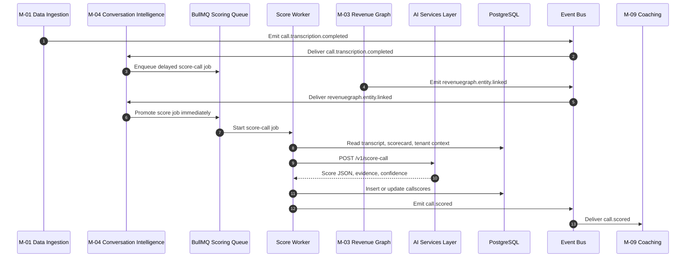
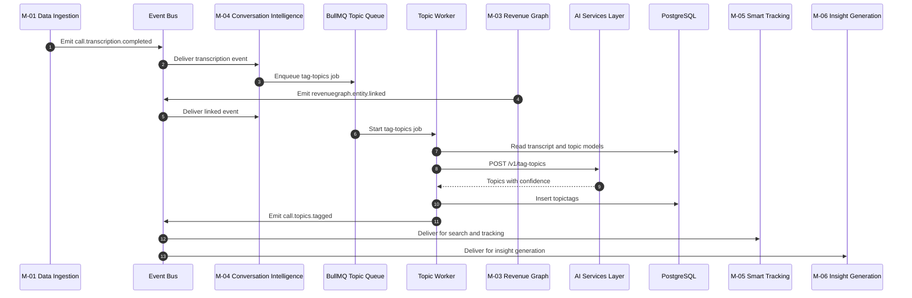
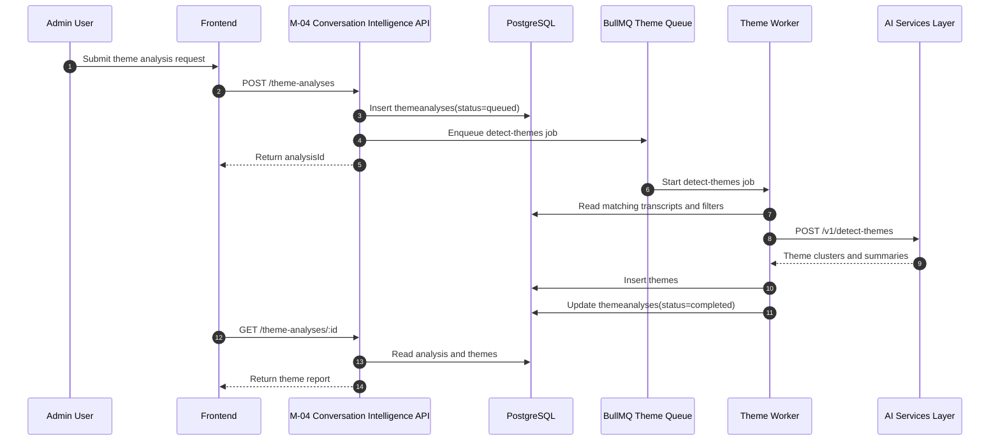
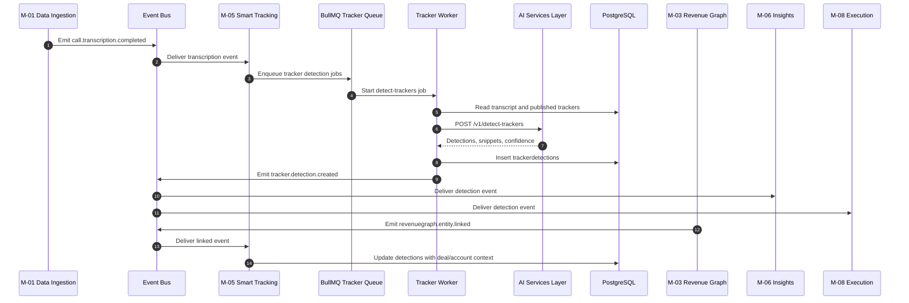
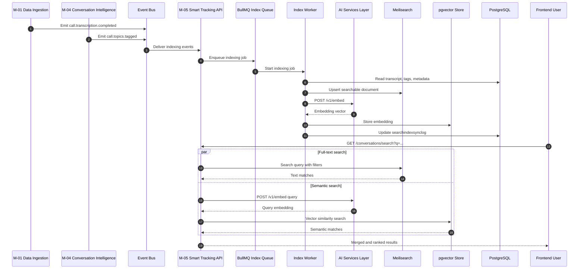
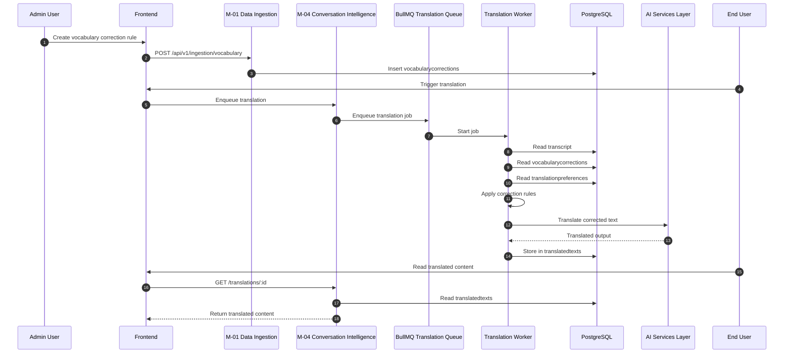

# Doc #14 — Sequence Diagrams for M2

This document defines the recommended sequence-diagram files for **M2 Conversation Intelligence**. Product-wise, M2 is one module, but in architecture it is mainly split across **M-04 Conversation Intelligence** and **M-05 Smart Tracking and Search**, so the diagrams below show flows using those backend ownership boundaries. 

A common rule across all M2 diagrams is that the flows are **async and event-driven**. Each sequence should clearly show the upstream event or request, queue handoff, worker execution, AI service call, DB write, and downstream event or read response. 

---

## SD-01 — Revenue Graph event to AI Call Reviewer to `call.scored`

### Diagram title

**SD-01 — Revenue Graph entity linked to AI Call Reviewer score persisted and `call.scored` emitted** 

### Purpose

This diagram shows how a completed call becomes a persisted AI review score after Revenue Graph context is available. M-04 must not finalize scoring too early because scorecards may depend on deal, account, or contact context coming from M-03. 

### Actors

- M-01 Data Ingestion 
- M-03 Revenue Graph 
- BullMQ queue and worker 
- M-04 Conversation Intelligence 
- AI Services Layer `POST /v1/score-call` 
- PostgreSQL `callscores` and related scorecard tables 
- Downstream consumer of `call.scored`, mainly M-09 Coaching and Training 

### Preconditions

- A call transcript has already been created upstream. 
- A scorecard exists and is active for the tenant. 
- The call may first arrive through `call.transcription.completed`, but final scoring should wait for `revenuegraph.entity.linked` or a delayed fallback window. 

### Main sequence

1. M-01 emits `call.transcription.completed` after transcript generation finishes. 
2. M-04 receives that event and enqueues a delayed score job with idempotent job identity. 
3. M-03 links the call to revenue entities and emits `revenuegraph.entity.linked`. 
4. M-04 promotes or triggers the scoring job immediately when that link event arrives. 
5. The worker loads transcript content, tenant context, scorecard rules, and any needed deal or account context. 
6. M-04 calls the AI Services Layer `POST /v1/score-call`. 
7. The AI service returns structured answers, evidence snippets, total score, confidence score, and review flags. 
8. M-04 persists the result in `callscores` or call review storage. 
9. M-04 emits `call.scored`. 
10. Downstream modules such as M-09 can consume the event. 

### Alternate paths

- If `revenuegraph.entity.linked` arrives quickly, the delayed job is promoted immediately and scoring happens early. 
- If linking does not arrive in time, the delayed score job still runs after the wait period so processing does not block forever. 
- If the link result is unmatched, M-04 should still process the call and surface the missing linkage as a warning instead of dropping the score flow. 

### Postconditions

- A score record exists for the call and tenant. 
- The score includes AI answers, total score, confidence score, and any review flag. 
- The `call.scored` event is available for downstream consumers. 

### Failure notes

- If the AI service times out or fails, BullMQ retries according to queue policy before dead-letter handling. 
- If a duplicate event is received, idempotency rules should prevent duplicate score rows for the same call and scorecard combination. 
- If Revenue Graph context is incomplete, scoring can still continue, but the result may be less context-rich. 

### Mermaid source

---

## SD-02 — Revenue Graph event to AI Topic Tagger to `call.topics.tagged`

### Diagram title

**SD-02 — Revenue Graph entity linked to AI Topic Tagger and `call.topics.tagged` emitted** 

### Purpose

This diagram shows how M-04 tags a call with structured discussion topics after transcript completion and Revenue Graph context availability. The result helps make conversations searchable and useful for downstream insight workflows. 

### Actors

- M-01 Data Ingestion 
- M-03 Revenue Graph 
- BullMQ queue and worker 
- M-04 Conversation Intelligence 
- AI Services Layer `POST /v1/tag-topics` 
- PostgreSQL `topictags` and topic model tables 
- M-05 Smart Tracking and M-06 Insight Generation as downstream consumers 

### Preconditions

- Transcript text exists. 
- Topic model definitions or tagging rules exist for the tenant or global model. 
- The event flow from M-01 and M-03 is active. 

### Main sequence

1. M-01 emits `call.transcription.completed`. 
2. M-04 enqueues a topic-tagging job. 
3. M-03 emits `revenuegraph.entity.linked` when account or deal linkage is ready. 
4. The worker loads transcript text and any useful business context. 
5. M-04 calls `POST /v1/tag-topics` on the AI Services Layer. 
6. The AI service returns a list of topics with confidence scores. 
7. M-04 persists topic tags into `topictags`. 
8. M-04 emits `call.topics.tagged`. 
9. M-05 uses the tags for search indexing and filtered discovery, while M-06 can use them in summaries and later analysis. 

### Alternate paths

- If a vocabulary rule or tenant topic model affects detection, topic output may differ by tenant. 
- If AI confidence is low, the tags may still be stored with low confidence metadata rather than blocked entirely. 
- If the event is replayed, idempotent tag handling should avoid creating duplicate tags for the same call-topic combination. 

### Postconditions

- Topic tags exist for the call. 
- Search and downstream analysis can use those tags. 
- `call.topics.tagged` is available as a downstream event. 

### Failure notes

- AI service failures should trigger retries. 
- Duplicate queue deliveries must not create duplicate tag rows. 
- If Meilisearch indexing is downstream-delayed, the DB remains the source of truth and search can catch up later. 

### Mermaid source

---

## SD-03 — Batch theme-analysis request to job processing to theme report ready

### Diagram title

**SD-03 — AI Theme Spotter batch analysis request to async processing and theme report ready** 

### Purpose

This diagram shows how a user-triggered batch theme analysis request becomes a completed theme report. Unlike per-call flows, this one starts from an API request and runs as a long-running async analysis job. 

### Actors

- Admin or analyst user through Frontend 
- M-04 Conversation Intelligence API 
- PostgreSQL `themeanalyses` and `themes` tables 
- BullMQ queue and worker 
- AI Services Layer `POST /v1/detect-themes` 
- Frontend polling `GET /api/v1/conversation-intelligence/theme-analyses/:id` 

### Preconditions

- The user is authenticated with permission to create theme analyses. 
- Enough transcript and call data exists for the chosen tenant filters. 
- The theme-analysis endpoint is available. 

### Main sequence

1. The admin frontend sends `POST /api/v1/conversation-intelligence/theme-analyses` with a business question and filters. 
2. M-04 validates the request and creates a `themeanalyses` row with status `queued`. 
3. M-04 enqueues a batch theme-analysis job. 
4. The worker loads the matching conversation set and relevant metadata. 
5. The worker calls `POST /v1/detect-themes` on the AI Services Layer. 
6. The AI service returns clustered themes, summaries, and supporting counts. 
7. M-04 writes theme rows into `themes` and updates `themeanalyses` status to `completed`. 
8. The frontend polls the read endpoint and receives the completed report. 

### Alternate paths

- If the dataset is very large, the worker may process in chunks before storing final themes. This is a practical implementation path even if the high-level contract remains one queued job. 
- If no meaningful themes are found, the analysis can still complete with an empty or low-signal result rather than fail. 
- If filters are invalid or unauthorized, the create request should fail before any job is enqueued. 

### Postconditions

- The analysis record is persisted with final status. 
- Theme rows exist and are linked to the analysis. 
- The frontend can fetch and display the report. 

### Failure notes

- If the AI job fails, `themeanalyses.status` should become `failed` after retry exhaustion. 
- Since this is a batch job, user-facing APIs should never block waiting for AI completion. 
- Partial writes should be avoided by wrapping the final status transition and theme persistence carefully. 

### Mermaid source

---

## SD-04 — Tracker detection flow from transcript context to `tracker.detection.created`

### Diagram title

**SD-04 — Transcript and context to Smart Tracker detection persisted and `tracker.detection.created` emitted** 

### Purpose

This diagram shows how M-05 detects business signals from transcripts using semantic intent detection, not plain keyword matching. The result is a persisted tracker detection that later powers summaries, automation, deal-risk views, and alerts. 

### Actors

- M-01 Data Ingestion 
- M-03 Revenue Graph 
- M-05 Smart Tracking 
- BullMQ queue and worker 
- AI Services Layer `POST /v1/detect-trackers` 
- PostgreSQL `trackers` and `trackerdetections` 
- Downstream consumers M-06 and M-08 

### Preconditions

- One or more published trackers exist for the tenant. 
- Transcript text exists for the call. 
- Revenue Graph enrichment may arrive later and update detections with deal or account linkage. 

### Main sequence

1. M-01 emits `call.transcription.completed`. 
2. M-05 receives the event and enqueues detection jobs for published trackers. 
3. The worker reads transcript text and published tracker definitions. 
4. M-05 calls `POST /v1/detect-trackers`. 
5. The AI service returns matched detections with snippets, timestamps, and confidence scores. 
6. M-05 persists rows in `trackerdetections`. 
7. M-05 emits `tracker.detection.created`. 
8. Later, when `revenuegraph.entity.linked` arrives, M-05 can enrich existing detections with deal and account context. 

### Alternate paths

- Email-driven tracker detection can also start from `email.sent` instead of transcript completion. 
- If confidence is below threshold, detections may be stored but filtered from some downstream views like Deal Drivers. 
- If no tracker matches are found, the worker completes with no emitted detection event. 

### Postconditions

- Matching detections are stored. 
- `tracker.detection.created` is emitted for downstream modules. 
- Detections may later be enriched with linked revenue context. 

### Failure notes

- The uniqueness rule on tracker and call should prevent duplicate detections during retries. 
- AI failures should retry asynchronously rather than block user APIs. 
- Missing Revenue Graph context should not stop initial semantic detection. 

### Mermaid source

---

## SD-05 — Search indexing and query flow for Searchable Conversation Library

### Diagram title

**SD-05 — Search indexing and hybrid query flow for Searchable Conversation Library** 

### Purpose

This diagram shows two connected flows: how conversation data gets indexed for search, and how a user query is served using hybrid full-text plus semantic retrieval. This is the main technical backbone behind the Searchable Conversation Library feature. 

### Actors

- M-01 Data Ingestion 
- M-04 Topic Tagging events 
- M-05 Smart Tracking and Search API 
- BullMQ indexing worker 
- Meilisearch 
- AI Services Layer `POST /v1/embed` 
- pgvector-backed embeddings store 
- Frontend user 

### Preconditions

- Calls, transcripts, and optionally topic tags already exist. 
- Search engine and vector store are available. 
- Search indexing rules and tenant isolation are configured. 

### Main sequence

#### Indexing path
1. M-01 emits `call.transcription.completed`. 
2. M-04 may later emit `call.topics.tagged`. 
3. M-05 consumes these events and queues indexing work. 
4. The worker transforms transcript and metadata into search documents. 
5. M-05 writes searchable text and filters into Meilisearch. 
6. For semantic retrieval, M-05 or the AI path calls `POST /v1/embed` and stores embeddings in pgvector-backed storage. 
7. M-05 records sync progress in `searchindexsynclog`. 

#### Query path
8. The frontend calls `GET /api/v1/smart-tracking/conversations/search`. 
9. M-05 runs Meilisearch full-text search and semantic vector search in parallel. 
10. M-05 merges and ranks the combined results. 
11. The API returns the filtered, ranked conversation list. 

### Alternate paths

- If embeddings are unavailable, M-05 can fall back to text-only search. 
- If topic tags arrive after transcript indexing, a later sync updates the existing search documents. 
- If a replayed index event occurs, `searchindexsynclog.idempotencykey` prevents duplicate sync runs. 

### Postconditions

- Search documents are available in Meilisearch. 
- Semantic retrieval support exists in pgvector-backed storage. 
- Users can search conversations using both keyword-style and meaning-based retrieval. 

### Failure notes

- If Meilisearch is degraded, search may fail or partially degrade even though PostgreSQL still has source data. 
- If embedding generation fails, the system should prefer degraded text search over a hard outage. 
- Index lag is a normal operational issue in async systems, so search freshness may briefly trail source-of-truth writes. 

### Mermaid source

---

## SD-06 — Transcript correction and translation flow

### Diagram title

**SD-06 — Transcript correction and translation flow for AI Transcriber and AI Translator** 

### Purpose

This optional combined diagram shows how transcript outputs are improved for human readability through vocabulary correction and then localized through translation preferences. It combines two closely related user-facing M2 features into one easier-to-read sequence. 

### Actors

- M-01 Data Ingestion and transcript storage 
- M-04 Conversation Intelligence 
- Admin user managing vocabulary rules 
- Frontend requesting translated content 
- AI Services Layer for language processing 
- PostgreSQL `vocabularycorrections`, `translationpreferences`, and transcript-related storage 

### Preconditions

- The transcript already exists. 
- Optional tenant vocabulary correction rules have been configured. 
- A translation preference exists at user, team, or tenant scope if translated output is requested. 

### Main sequence

#### Correction path
1. An admin creates vocabulary correction rules using `POST /api/v1/ingestion/vocabulary`. 
2. M-04 stores rules in `vocabularycorrections`. 
3. When transcript outputs are prepared for display or downstream AI use, M-04 applies the correction rules to business-specific terms. 
4. Corrected terms can be logged in transcript correction history. 

#### Translation path
5. A user or system requests translated transcript or summary output.
6. M-04 enqueues an async translation job.
7. The worker loads the target language from `translationpreferences`.
8. The worker sends the corrected text to the AI service for translation processing.
9. The translated output is stored in `translatedtexts`.
10. The frontend requests `GET /api/v1/conversation-intelligence/translations/:id` to read the stored translation.

### Alternate paths

- If no vocabulary rule exists, the original transcript text is used as-is. 
- If no translation preference exists, the source language output may be returned directly. 
- If translation fails, the system should keep the source-language content available instead of blocking access. 

### Postconditions

- Business-specific terms are corrected where rules apply. 
- Translated transcript or summary output is available for the target language. 
- The user sees cleaner and more accessible conversation content. 

### Failure notes

- Over-aggressive correction rules can damage transcript meaning, so rules should be tenant-scoped and reviewed carefully. 
- Translation should not overwrite the original source transcript because the source remains the reference record. 
- AI translation failures should degrade gracefully to source-language output. 

### Mermaid source

---

## Authoring notes

When creating the actual files, keep one diagram per file and name them exactly as `SD-01.md` through `SD-06.md` or a similar stable naming pattern. The Mermaid source should stay close to the documented sequence so freshers can trace the system from event input to queue to worker to AI service to DB to event output without guessing hidden steps. 

For M2 specifically, never draw these flows as purely synchronous request-response chains. The architecture is explicit that inter-module communication and AI-heavy workflows use BullMQ, Redis-backed async processing, retries, and idempotent event handling. 

